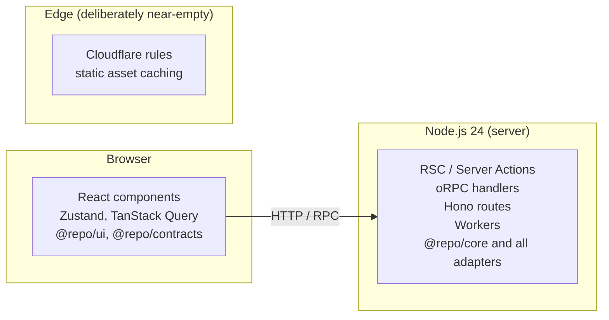

# 01 — Principles & constraints

Every decision in this repository is derived from the principles below. When a future decision
is contested, resolve it by asking which principle it serves — not by preference.

---

## 1. Principles, in priority order

When two principles conflict, the higher one wins. This ordering is the actual content; a list
of virtues nobody ranked is useless.

### 1. Maintainability over everything

Code is read and modified far more than it is written. Concretely:

- **Boring beats clever.** A repeated 10-line function is better than an abstraction that needs
  a diagram.
- **Explicit beats implicit.** No magic auto-registration, no decorator metadata, no global
  mutable singletons that hide their initialisation order.
- **Local reasoning.** A reader should understand a file without opening five others. This is
  the main reason business logic is grouped by feature, not by technical layer.
- **Deletability.** Every feature module must be removable by deleting its folder and its
  registration line. If it cannot be deleted cleanly, it was not a module.

### 2. Correctness is a type-system problem where possible

- `strict` is not enough: no `any`, no non-null assertions in application code, no unchecked
  casts. Where the type system genuinely cannot know (parsing external input), a Zod schema is
  the boundary, and the parsed type flows inward.
- **Parse, don't validate.** External input is parsed once at the boundary into a domain type.
  Nothing downstream re-checks it.
- Illegal states are made unrepresentable in preference to being checked at runtime.

### 3. Explicit boundaries

Every module declares what it exposes. Every package declares what it depends on. Every layer
knows which direction dependencies flow. Boundaries that are only documented are not boundaries;
they must be mechanically enforced ([03](./03-package-graph-and-boundaries.md)).

### 4. Production-ready by default

The default configuration is the safe one. Insecure or expensive behaviour must be opted into,
never opted out of:

- Authorization denies by default.
- Env validation fails the build, not the first request.
- Migrations never run implicitly.
- Logs are structured and redacted by default.
- Images run as non-root with a healthcheck.

### 5. Cloud-agnostic, self-host-first

If a feature can only exist on one vendor's platform, it does not enter the foundation. This
costs a little convenience and buys the ability to move. In practice:

- S3 **API**, not the R2 SDK.
- OTLP to a collector we run, not a vendor agent.
- PostgreSQL over TCP, not a proprietary serverless driver as the default.
- Nothing in application code imports `@vercel/*`.

Self-hosting is the harder target, so it is the _primary_ one; managed platforms then work
without special-casing.

### 6. Minimal but powerful dependencies

Every dependency is a permanent liability: supply-chain surface, upgrade work, a ceiling on what
you can change. The bar to add one:

> Does it solve a problem that is genuinely hard, is it likely to outlive our project, and would
> replacing it later be tractable?

If we would write fewer than ~150 lines to replace it, we write the lines. This is why
`@repo/env` is hand-rolled and why `neverthrow` is rejected.

### 7. Developer experience is a feature, not a reward

A slow or noisy feedback loop causes bugs; it does not merely annoy. Targets, treated as
requirements:

| Loop                                     | Target  |
| ---------------------------------------- | ------- |
| Cold `pnpm install`                      | < 60 s  |
| `make dev` to serving requests           | < 20 s  |
| Incremental typecheck (whole repo, warm) | < 5 s   |
| Lint + format whole repo                 | < 3 s   |
| Unit test suite                          | < 10 s  |
| CI on a typical PR                       | < 6 min |

These numbers are the reason the toolchain is on the native tier, and they are asserted in CI
so regressions are visible.

### 8. Everything documented, close to the code

Documentation that lives elsewhere dies. ADRs, package `README`s, and this document are in the
repo and reviewed in the same PR as the change they describe.

---

## 2. Hard constraints

These are not preferences; treat them as compile errors.

| #   | Constraint                                                                                                                                                                                   | Enforced by                                                     |
| --- | -------------------------------------------------------------------------------------------------------------------------------------------------------------------------------------------- | --------------------------------------------------------------- |
| C1  | No business logic in a React component, route handler, oRPC procedure, or Server Action. They orchestrate only.                                                                              | Review + layering; resolvers are expected to be under ~15 lines |
| C2  | No database access outside `packages/db` and `packages/core`.                                                                                                                                | pnpm cannot resolve `@repo/db` where it is not declared         |
| C3  | Runtime config is selected in app env modules and passed to `createEnv`; libraries never read `process.env` ad hoc. Process-edge metadata and test/tooling controls are boundary exceptions. | Review + env schema boundaries                                  |
| C4  | No secret may reach the client bundle. Client env vars must be `NEXT_PUBLIC_`-prefixed and declared in the client schema.                                                                    | Split env schemas + CI check                                    |
| C5  | Authorization is never inferred from routing. Every core service that touches tenant data takes an `actor` and consults a policy.                                                            | Review + policy-coverage test                                   |
| C6  | Every tenant-scoped query filters by `organization_id`.                                                                                                                                      | Scoped query helpers; RLS optional as defence                   |
| C7  | Migrations are reviewed SQL committed to Git, applied by an explicit job.                                                                                                                    | CD pipeline; `push` is local-only                               |
| C8  | No cyclic dependency between packages, ever.                                                                                                                                                 | `turbo` graph + CI check                                        |
| C9  | `packages/ui` must not import any server-side package.                                                                                                                                       | Layering + `exports` map                                        |
| C10 | Every log line is structured; no `console.*` in application code.                                                                                                                            | Lint rule                                                       |
| C11 | Every error crossing a transport boundary has a stable machine-readable code.                                                                                                                | `AppError` type + transport mappers                             |
| C12 | No `any`, no `as` casts to unrelated types, no non-null `!` in application code.                                                                                                             | Oxlint type-aware rules                                         |
| C13 | Every public REST change is reflected in the OpenAPI document, which is generated — never hand-written.                                                                                      | Spec is derived from Zod schemas; CI diffs it                   |
| C14 | CI is the only thing that builds release artifacts. No local `docker push`.                                                                                                                  | Registry permissions                                            |

---

## 3. Runtime boundaries

A recurring source of production bugs is code that works in one runtime and not another. We
define exactly three runtime classes and never blur them.

- **Browser-safe packages** (`contracts`, `ui`, `utils`, `types`, `i18n`, the client half of
  `env`, `analytics` client, `flags` client) must never transitively import `node:*`, Drizzle,
  Pino, or Better Auth's server entry.
- **Server-only packages** carry `"server-only"` in their entry point so an accidental client
  import fails loudly at build time rather than leaking secrets.
- **Edge is not a deployment target for our code.** Next 16's `proxy.ts` runs on the Node
  runtime; the deprecated `middleware.ts` Edge path is not used. This deliberately removes an
  entire category of "works locally, breaks at the edge" bugs, and is only possible because
  Next 16 made Node the proxy runtime.

---

## 4. Where we deliberately accept complexity

An honest architecture names its own costs. These are the places we knowingly spend complexity,
and what we get for it.

| Accepted cost                   | What it buys                                                                 | Why it is worth it                                                                       |
| ------------------------------- | ---------------------------------------------------------------------------- | ---------------------------------------------------------------------------------------- |
| A monorepo with ~20 packages    | Enforced boundaries, independent testability, one core behind two transports | The alternative (one `src/lib`) has no enforceable boundaries at all                     |
| Ports/adapters for side effects | Core is testable without network, vendors are swappable                      | Only applied where vendors actually change: email, storage, payments, jobs, flags, clock |
| Two API surfaces (oRPC + REST)  | Best-in-class internal DX _and_ a stable public contract                     | Cost is near zero because both are thin transports over the same services                |
| Two job systems                 | Right tool per workload class                                                | Contracts are shared; either can be removed without touching core                        |
| Generated OpenAPI from Zod      | Docs and spec cannot drift from the code                                     | Hand-written specs are always wrong within a month                                       |
| Multi-tenancy from day one      | No brutal retrofit later                                                     | Q3 in the [index](./README.md#7-open-questions-requiring-your-decision)                  |

And the places we deliberately refuse complexity: no CQRS, no event sourcing, no message broker
beyond Redis, no microservices, no GraphQL, no generic repository interface over the ORM, no
DI container framework (plain function composition instead), no custom Babel/SWC plugins.

---

## 5. The test of this architecture

A foundation is good if these operations are cheap. Each is used later as an acceptance check on
the implementation.

1. **Add a feature.** Create one folder in `packages/core`, one oRPC router file, optionally one
   REST route, one migration, one test file. No changes to shared plumbing.
2. **Delete a feature.** Delete the folder plus its two registration lines.
3. **Swap a vendor.** Replace Resend with SES by writing one adapter; no core file changes.
4. **Onboard an engineer.** `make setup && make dev` works on a clean machine, and the vertical
   slice shows them the pattern for everything else.
5. **Trace a production incident.** One correlation ID links a browser session, a log line, a
   trace, a Sentry issue, and a job run.
6. **Migrate the database with zero downtime.** Expand/contract is the documented default, not a
   heroic exception.
