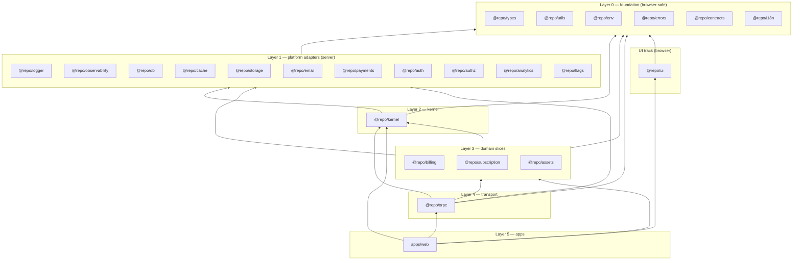

# 03 — Package graph & boundaries

The value of a monorepo is not code sharing — a single `src/lib` shares code too. The value is
**enforceable boundaries**. This document defines them and, more importantly, how they are
enforced by mechanisms nobody can casually bypass.

---

## 1. The layer rule

Every package belongs to exactly one layer. **A package may depend only on packages in strictly
lower layers, with one exception below.** No upward dependencies, ever.

| Layer | Name              | Runtime        | Packages                                                                                                        |
| ----- | ----------------- | -------------- | --------------------------------------------------------------------------------------------------------------- |
| 0     | Foundation        | Browser + Node | `types`, `utils`, `env`, `errors`, `contracts`, `i18n`, `permissions`                                           |
| 1     | Platform adapters | Node only      | `logger`, `observability`, `db`, `cache`, `storage`, `email`, `payments`, `auth`, `authz`, `analytics`, `flags` |
| 2     | Kernel            | Node only      | `kernel` (request context, ports, audit log, outbox)                                                            |
| 3     | Domain slices     | Node only      | `billing`, `subscription`, `assets`                                                                             |
| 4     | Transport         | Node only      | `orpc`                                                                                                          |
| 5     | Applications      | —              | `apps/web`                                                                                                      |
| U     | UI                | Browser        | `ui` (may depend on layer 0 only)                                                                               |
| T     | Tooling           | Build-time     | `tooling/*` (`@repo/tsconfig`, `@repo/vitest-config`, `@repo/tailwind-config`, `@repo/oxlint-config`)           |

**Layer 0 may depend on other layer-0 packages**, forming a small DAG (`errors → types`,
`contracts → types + utils`). Cycles are still rejected. This is the one same-layer exception:
foundation packages share branded types and pure helpers, and inventing a layer below 0 just to
satisfy the letter of the rule would add ceremony without adding safety.

**From layer 1 up, same-layer dependencies are banned.** That is the rule that does the most work.
It is what keeps adapters from coupling — when two layer-1 packages seem to need each other, the
correct answer is always one of: move the shared piece down to layer 0, let layer 2 orchestrate
both, or inject a function. See the `db` / `logger` note below.

---

## 2. The graph



### Selected concrete dependency lists

| Package             | Depends on                                                                                                                                                                                                                  |
| ------------------- | --------------------------------------------------------------------------------------------------------------------------------------------------------------------------------------------------------------------------- |
| `@repo/utils`       | _(nothing internal)_                                                                                                                                                                                                        |
| `@repo/types`       | _(nothing internal)_                                                                                                                                                                                                        |
| `@repo/errors`      | `types`                                                                                                                                                                                                                     |
| `@repo/contracts`   | `types`, `utils`                                                                                                                                                                                                            |
| `@repo/permissions` | `types` — the RBAC registry both layer-1 auth packages read                                                                                                                                                                 |
| `@repo/env`         | _(nothing internal)_ — Zod only                                                                                                                                                                                             |
| `@repo/db`          | `env`, `types`, `utils`, `logger` ✗ — see note                                                                                                                                                                              |
| `@repo/authz`       | `types`, `errors`, `permissions`                                                                                                                                                                                            |
| `@repo/auth`        | `types`, `permissions` — db schema + email/Redis callbacks are injected (same-layer ban)                                                                                                                                    |
| `@repo/kernel`      | layer 0 + `db`, `logger` (side-effect ports for mail/files/flags/analytics/payments; adapters injected)                                                                                                                     |
| `@repo/billing`     | `kernel` + layer 0 + `db`, `authz`                                                                                                                                                                                          |
| `@repo/assets`      | `kernel` + layer 0 + `db`, `authz`, `storage` — the only package depending on `storage`                                                                                                                                     |
| `@repo/orpc`        | `kernel`, `billing`, `subscription`, `assets`, `auth`, `errors`, `contracts`, `logger`, `db`, `types`                                                                                                                       |
| `@repo/ui`          | _(nothing internal yet)_ — may use layer 0 only (`types`, `utils`, `i18n`); theme CSS from `@repo/tailwind-config` (dev/build)                                                                                              |
| `apps/web`          | `ui`, `orpc`, `kernel`, `billing`, `subscription`, `assets`, `auth`, `cache`, `db`, `email`, `env`, `i18n`, `logger`, `observability`, `analytics`, `flags`, `payments`, `storage`, `contracts`, `types`, `utils`, `errors` |
| `apps/api`          | `core`, `auth`, `orpc` (parity tests), `contracts`, `errors`, `env`, `logger`, `cache`, `db`, `email`, `jobs`, `payments`, `types`, `utils`                                                                                 |

> **Note on `db` → `logger`:** both are layer 1, so `@repo/db` may not import `@repo/logger`.
> This is not pedantry — it is what keeps `@repo/db` usable in migration scripts and tests
> without a logging stack. Drizzle's query logging is injected: the app's composition root
> passes a `{ logQuery }` callback built from its logger. The general pattern for "a layer-1
> package needs another layer-1 capability" is **inject a function, don't import a package.**

---

## 3. Enforcement

Documented boundaries decay. These are enforced mechanically, in four independent ways, ordered
from strongest to weakest.

### 3.1 pnpm isolated `node_modules` — physical enforcement

This is the primary mechanism and it is nearly unbeatable. pnpm creates a `node_modules` tree
containing **only** each package's declared dependencies. If `@repo/ui` does not declare
`@repo/db`, then `import { db } from "@repo/db"` inside `@repo/ui` does not resolve — not as a
lint warning, but as a module resolution failure in the editor, the typechecker, and the build.

The consequence for reviewers is powerful: **the dependency graph is reviewable as a diff.**
Violating a boundary requires adding a line to a `package.json`, which is exactly the kind of
change a human notices and `CODEOWNERS` can gate.

Requires `node-linker=isolated` (pnpm's default) and no hoisting escape hatches:

```ini
# .npmrc
node-linker=isolated
shamefully-hoist=false
auto-install-peers=false
strict-peer-dependencies=true
```

### 3.2 Package `exports` maps — surface enforcement

Layer enforcement stops undeclared _packages_; `exports` stops reaching into a package's
internals. Every package declares an explicit `exports` map with no wildcard into `src`:

```jsonc
{
  "exports": {
    ".": "./src/index.ts",
    "./chart": "./src/chart/index.ts",
  },
}
```

No consumer can do `@repo/billing/src/billing.repository`. Deep-import restrictions are how
a package keeps the freedom to refactor its internals.

### 3.3 `server-only` / `client-only` — runtime-class enforcement

Server packages import `server-only` in their entry point. If any of them is transitively pulled
into a client component, the Next build fails with a clear message. This is the guard that stops
a credential leak, so it is applied to `db`, `auth` (server entry), `payments`, `email`,
`storage`, `cache`, `logger`, `env/server`, `kernel`, and every slice package.

Conversely `@repo/ui` interactive components carry `"use client"`, and `@repo/ui` has no
`node:*` imports anywhere in its transitive graph — asserted by a test.

### 3.4 Automated checks in CI

| Check                    | Tool                                                                  | Catches                                                    |
| ------------------------ | --------------------------------------------------------------------- | ---------------------------------------------------------- |
| Cycle detection          | `turbo run build --dry=json` graph assertion                          | Any cyclic package dependency                              |
| Layer assertion          | Small script over every `package.json` comparing declared layers      | An upward or same-layer dependency added deliberately      |
| Boundary check           | `turbo boundaries`                                                    | Imports not matching declared dependencies                 |
| Unused / undeclared deps | Knip                                                                  | Phantom dependencies that would break the isolated install |
| Browser-safety           | Test that imports `@repo/ui` and `@repo/contracts` in a jsdom project | Accidental `node:*` in a browser package                   |
| Bundle budget            | Parse `next build` output against committed budgets                   | A heavy dep leaking into the base bundle                   |

Each package declares its layer in its own manifest, so the assertion script needs no central
registry to drift out of date:

```jsonc
// packages/kernel/package.json
{ "name": "@repo/kernel", "repo": { "layer": 2, "runtime": "node" } }
```

---

## 4. Ports and adapters — applied narrowly

Dependency inversion is applied **only where the implementation is genuinely likely to change or
genuinely painful in tests.** Inverting everything produces an unreadable codebase whose
indirection buys nothing.

### Inverted (ports defined in `@repo/kernel/src/ports/`, implemented in layer 1)

| Port             | Why inverted                                                             |
| ---------------- | ------------------------------------------------------------------------ |
| `Mailer`         | Vendors change (Resend → SES → Postmark). Tests must not send email.     |
| `FileStore`      | R2/MinIO/S3 today, something else later. Tests must not hit the network. |
| `PaymentGateway` | Stripe is sticky but its test surface is slow and awkward.               |
| `JobQueue`       | BullMQ today; port keeps core independent of queue mechanics.            |
| `Clock`          | Time-dependent logic is otherwise untestable.                            |
| `IdGenerator`    | Deterministic ids make assertions readable.                              |
| `EventBus`       | Domain events must be assertable in unit tests.                          |
| `FlagProvider`   | Env-based locally, PostHog in production.                                |
| `AnalyticsSink`  | Tests must not emit product events.                                      |

### Not inverted, deliberately

| Not inverted           | Why                                                                                                                                                                                                                                                                                                                                                                                                                           |
| ---------------------- | ----------------------------------------------------------------------------------------------------------------------------------------------------------------------------------------------------------------------------------------------------------------------------------------------------------------------------------------------------------------------------------------------------------------------------- |
| **The database / ORM** | A repository interface over Drizzle is a classic anti-pattern: it either leaks Drizzle's query builder through the interface, or reimplements it badly. Drizzle _is_ the abstraction over SQL. Repository _functions_ per feature give us the seam we actually want (a named, testable query surface) without a fake portability layer. Integration tests run against real PostgreSQL, which is where SQL bugs actually live. |
| **The logger**         | Pino is injected as a value, not abstracted. Swapping structured loggers is a day's work and no test needs a fake logger.                                                                                                                                                                                                                                                                                                     |
| **HTTP frameworks**    | Next and Hono are the outermost layer; nothing depends on them.                                                                                                                                                                                                                                                                                                                                                               |
| **Zod**                | It is our type vocabulary, not an adapter. Abstracting it would abstract the type system.                                                                                                                                                                                                                                                                                                                                     |

The rule of thumb: **invert what crosses the network or the clock; do not invert what defines
your types or your data.**

### How injection works — no DI framework

Plain function composition. Each app's composition root builds the dependency object once:

```
// apps/*/src/container.ts   (illustrative shape)
buildContainer(env) → {
  db, cache, mailer, fileStore, payments, queue, clock, ids, events, flags, analytics
}
```

A request-scoped `Ctx` then carries `{ ...container, actor, logger, traceId, tx? }` into core
services. Core services are plain functions taking `(ctx, input)`.

This gives constructor injection's testability with no container library, no decorators, no
reflect-metadata, and no startup-order magic. A test builds a `Ctx` from in-memory fakes in three
lines. Adding a DI framework here would add a dependency, a lifecycle concept, and a class of
runtime errors, in exchange for nothing.

---

## 5. Cross-slice communication

Each domain slice is its own layer-3 package ([ADR-0013](../adr/0013-kernel-and-slice-packages.md)),
so slices sit at the same layer and **cannot import each other at all**. That is not a convention:
they are peers under the same-layer ban, and pnpm's isolated `node_modules` makes an undeclared
import unresolvable.

Two mechanisms remain, in order of preference:

1. **Emit a domain event.** Correct when the emitter should not care who reacts — e.g.
   `invoice.voided` triggering an email. Keeps slices independently deletable.
2. **Move the shared rule down.** If two slices need the same rule, it belongs in `@repo/kernel`
   (or in layer 0 if it is pure).

There is deliberately no third option. Calling another slice's service was the preferred mechanism
when slices were folders inside one package; it is now illegal, and that is the main cost recorded
in ADR-0013. If two slices need each other synchronously and often, the split is in the wrong place
— reconsider the boundary rather than reaching for an exception.

### Domain events

Events are Zod-schema'd, named `<aggregate>.<past-tense-verb>`, published through the injected
`EventBus`, and consumed by in-process handlers (analytics, cache invalidation). Events are **not**
an event-sourcing store: they are notifications, the database remains the source of truth.

Ordering and delivery guarantees are stated explicitly per handler because pretending they are
exactly-once causes duplicate emails. In-process handlers are best-effort within the request;
anything that must not be lost is written to the **transactional outbox in the same transaction**
as the state change (see [06](./06-data-and-storage.md)). With no worker
([ADR-0014](../adr/0014-single-transport-and-no-background-worker.md)), the outbox is drained
in-process after a mutating request commits, and the relay dispatches to a handler registry
supplied by the composition root — so the kernel names no slice.

---

## 6. Why not the alternatives

| Alternative                                                  | Why rejected                                                                                                                                                                                                                                                                                                                                                                           |
| ------------------------------------------------------------ | -------------------------------------------------------------------------------------------------------------------------------------------------------------------------------------------------------------------------------------------------------------------------------------------------------------------------------------------------------------------------------------- |
| Single Next.js app with `src/lib`                            | No enforceable boundary. Business logic and React drift together, the public API becomes a copy of internal logic, and workers cannot be deployed separately.                                                                                                                                                                                                                          |
| Full hexagonal architecture with an interface per dependency | Indirection cost paid on every file for portability we will never exercise on the ORM. We take the 20 % of hexagonal that provides ~90 % of the testability.                                                                                                                                                                                                                           |
| Nx with generators and enforced module boundaries via ESLint | Nx's boundary enforcement is a lint rule (bypassable, and ESLint is now blocked on TypeScript 7); pnpm's isolated installs are physical. Turborepo + pnpm gives stronger enforcement with less tooling.                                                                                                                                                                                |
| Folders inside one `@repo/core` package                      | What this repo did until [ADR-0013](../adr/0013-kernel-and-slice-packages.md). Cheaper — one manifest, one coverage floor — but the cross-slice boundary was a convention, and the lint rule these docs claimed enforced it was never written. Package boundaries are enforced by the module graph instead. The cost is per-slice boilerplate and losing slice-to-slice service calls. |
| Publishing internal packages to a registry                   | Nothing outside this repo consumes them. Versioning internal packages you always deploy together is pure cost. Changesets is used for changelogs and coordinated releases, not to gate internal consumption.                                                                                                                                                                           |
| Per-package build step (`tsc -b`) emitting `dist/`           | ~20 build steps, stale-artifact bugs, and a slower loop, to satisfy nothing. Next transpiles workspace packages natively; backend apps are bundled once at image build. Source-only internal packages are the modern default for a reason.                                                                                                                                             |
