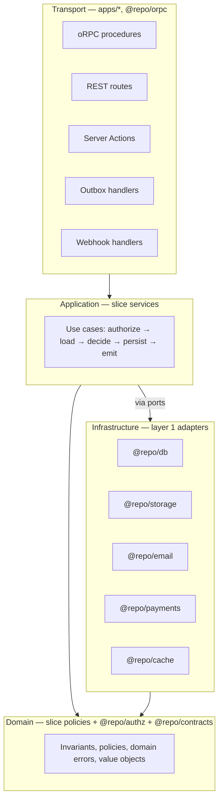
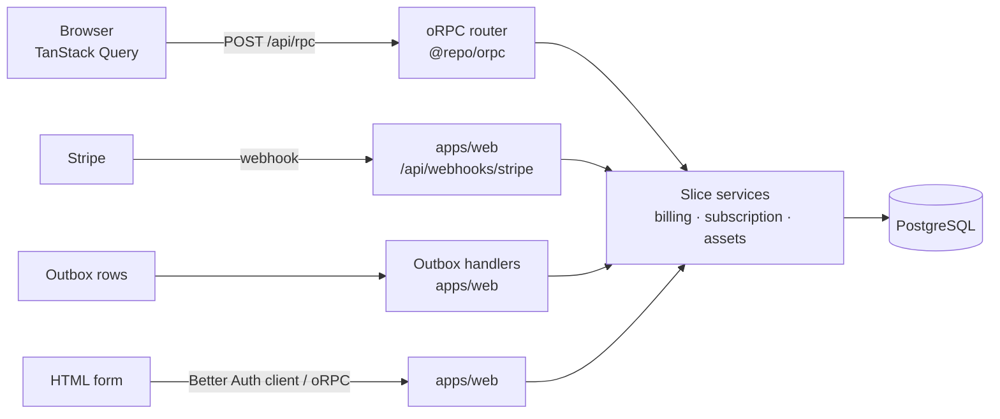

# 05 — Runtime architecture & API strategy

---

## 1. Clean architecture, as actually practised

The textbook diagram has four rings. Applied literally to a TypeScript product monorepo it
produces ceremony without benefit. What we keep is the one rule that pays for itself:

> **Business rules do not depend on delivery mechanisms or infrastructure. Dependencies point
> inward. Anything that crosses a process boundary is behind a port.**

What we drop: an interface for every dependency, entity/DTO duplication at every layer, and a
"use case class" per operation.

### The four concentric responsibilities



The load-bearing consequence: **there are five transports and one implementation of every rule.**
A rule such as "an invoice cannot be voided after payment" exists in exactly one function, and
the web UI, the public API, a background job, and a Stripe webhook all reach it.

### What each layer may do

| Layer                 | May                                                                                            | May not                                                     |
| --------------------- | ---------------------------------------------------------------------------------------------- | ----------------------------------------------------------- |
| Transport             | Parse input, resolve actor, call one service, map result/errors to the wire, set cache headers | Contain a business rule, query the DB, decide authorization |
| Application (service) | Authorize, orchestrate, transact, emit events, call ports                                      | Know about HTTP, React, oRPC, or queue mechanics            |
| Domain                | Enforce invariants, compute, decide                                                            | Perform any I/O                                             |
| Infrastructure        | Talk to the outside world                                                                      | Contain a business rule                                     |

### The canonical service shape

Every service follows the same five beats, in this order. Consistency here is what makes an
unfamiliar feature readable in thirty seconds:

```
async function voidInvoice(ctx, input) {
  // 1. AUTHORIZE  — deny by default, using the actor on ctx
  // 2. LOAD       — fetch aggregates through the feature repository
  // 3. DECIDE     — pure domain logic; throws typed domain errors
  // 4. PERSIST    — write, transactionally, with the outbox if events must not be lost
  // 5. EMIT       — domain events → analytics, jobs, cache invalidation
}
```

Authorization is first so that an unauthorized caller cannot learn whether a resource exists
through timing or error differences.

---

## 2. API strategy

**One transport: oRPC.** The public REST/OpenAPI surface was removed in
[ADR-0014](../adr/0014-single-transport-and-no-background-worker.md) — read
[ADR-0003](../adr/0003-one-domain-core-two-transports.md) before adding one back, because its
reasoning about implementing the same rules twice has not changed, and the layering that makes a
second transport cheap is still in place.

What "one transport" does _not_ mean: the separation between transport and domain is unchanged.
Every entry point still parses input, resolves an actor, calls exactly one slice service, and maps
errors to its wire format. That is what keeps the Stripe webhook and the outbox handlers from
growing their own copies of the rules.



### 2.1 Private API — oRPC

**Why oRPC:** the client and server ship together, so a compile-time contract is strictly better
than a runtime one. No codegen step, no schema drift window, and refactors propagate as type
errors. TanStack Query helpers give caching, invalidation, and optimistic updates without a
React provider. See [ADR-0011](../adr/0011-orpc-private-api.md) and
[ADR-0012](../adr/0012-orpc-2-private-api.md).

Structure:

- `@repo/orpc` owns the context type, layered procedure builders, and feature routers.
- Procedures are layered, so authorization is structural rather than remembered:
  - `publicProcedure` — no actor.
  - `protectedProcedure` — requires an authenticated actor.
  - `orgProcedure` — requires an active organization membership; puts a tenant-scoped
    `serviceCtx` in place so queries cannot forget the tenant filter.
- One router file per feature, merged as `appRouter` in `@repo/orpc` and mounted from
  `apps/web/src/server/router.ts`.
- Input **and** output schemas are declared from `@repo/contracts`. Output schemas are not
  optional: they are what stops an internal field from silently entering a response.
- Middleware converts `AppError` → `ORPCError` with the stable code on `data.appCode`, so the
  client can map codes to localized messages.
- oRPC's built-in serializer covers `Date`, `Map`, and `Set`. SuperJSON is not used.
- Session cookies (`SameSite=Lax`) plus POST-only RPC (the handler rejects GET). Batch
  requests stay enabled. v2 removed the v1 custom-header CSRF plugin pair; see
  [ADR-0012](../adr/0012-orpc-2-private-api.md).

Resolvers stay under ~15 lines. A resolver that grows is a service that was not written.

oRPC can generate OpenAPI from the same procedures. **We do not.** The public API is a
deliberately different contract (see 2.2).

### 2.2 Public API — not present

There is no public REST surface, no `/v1`, no committed `openapi.json`, and no `make openapi-check`.
Removed along with `apps/api`.

The conventions it followed are worth keeping in mind if you add one, because most of them are
decisions rather than defaults: cursor-only pagination with opaque signed cursors; RFC 9457
`application/problem+json` errors where `code` is the stable contract and `detail` is human text;
`Idempotency-Key` on every mutation, replayed from Redis; per-IP and per-key fixed-window rate
limits; and an explicit filter/sort allowlist rather than a query DSL. The full reasoning is in
[ADR-0003](../adr/0003-one-domain-core-two-transports.md).

One thing not to assume: OpenAPI generation is not a port swap. The old pipeline derived the
document from the Hono route registry, so the spec could not drift from validation. oRPC can emit
OpenAPI, but through a different generator over a different router — that is a project, not a
re-wiring.

Idempotency in particular is **gone, not relocated**. `apps/web` has per-IP rate limiting on
`/api/rpc` and nothing else; there is no `Idempotency-Key` handling anywhere.

### 2.3 Server Actions

An allowed transport for form mutations where progressive enhancement matters. **None ship
today.** Auth screens use the Better Auth client; product mutations (invoices, billing) go
through oRPC. When a flow needs a Server Action, the rules are:

- An action is a transport: `parse → resolve actor → call service → revalidate → return typed
result`.
- Every action re-validates input server-side with the same schema the form used. Client
  validation is UX, never a security control.
- Actions return a typed result rather than throwing, so forms can render field errors.
- Never used as a general-purpose RPC. If it is not a form, it is an oRPC mutation.

### 2.4 Webhook ingestion

Inbound webhooks (Stripe today) live in `apps/web/src/app/api/webhooks/stripe/route.ts`. Next
route handlers give raw-body access via `await request.text()`, which signature verification needs.

The handler: verify signature → claim a replay guard in Redis → **apply the event inline** →
return 200. Applying inline is a consequence of having no queue
([ADR-0014](../adr/0014-single-transport-and-no-background-worker.md)) and it changes the failure
model: the HTTP response is the only signal Stripe has, so a failure must surface as a non-2xx and
let Stripe retry. Returning 200 and then failing would silently drop the event.

The replay claim is released on any failure. Holding it would answer Stripe's retry `replay: true`
and lose the event — which is exactly the bug the guard exists to prevent.

---

## 3. Request lifecycle

The full path for an authenticated mutation, which is the path most bugs live on:

```mermaid
sequenceDiagram
    participant B as Browser
    participant P as proxy.ts (Node)
    participant R as oRPC handler
    participant C as Context builder
    participant S as slice service
    participant Z as authz policy
    participant D as PostgreSQL
    participant X as outbox drain

    B->>P: POST /api/rpc/billing.void (cookie)
    P->>P: Locale + cookie presence only. No authorization.
    P->>R: forward
    R->>R: per-IP rate limit (Redis counter). 429 before any DB work.
    R->>C: build Ctx
    C->>C: verify session (Better Auth), load actor + memberships
    C->>C: create request logger + trace span + request id
    R->>R: parse input (Zod). Reject 400 on failure.
    R->>S: voidInvoice(ctx, input)
    S->>Z: can(actor, "invoice:void", invoice)
    Z-->>S: allow / deny → ForbiddenError
    S->>D: load invoice (tenant-scoped)
    S->>S: domain decision → typed error if invalid
    S->>D: BEGIN; update invoice; insert outbox row; COMMIT
    S-->>R: Invoice DTO
    R->>X: drain outbox (after commit)
    X->>D: claim pending rows, run handlers, mark published
    R-->>B: JSON (with a stable error code on failure)
```

Points that matter:

1. **`proxy.ts` never authorizes.** It runs before session verification against the database and
   is easy to reason about wrongly. It does locale resolution, redirects for obviously-anonymous
   traffic (cookie absent), and security headers. Even though Next 16 runs it on Node — so it
   _could_ query the database — it deliberately does not: an authorization check in the proxy is
   invisible from the service it protects, and any route reachable another way is then
   unprotected.
2. **The actor is resolved once per request** and carried on `ctx`. No service re-reads the
   session.
3. **The rate limit runs before the context builder.** Resolving the session and the active
   organization each cost a database round trip, so a limiter behind them would leave the cheap
   path for brute force and saturation unmetered.
4. **The transaction wraps state change and outbox insert together**, so an event cannot be lost
   after a commit or emitted after a rollback.
5. **The outbox is drained after the response is built, not inside the transaction.** With no
   worker there is nothing polling it, so a mutating request drains it. The relay claims rows with
   `for update skip locked`, so concurrent requests do not double-handle a row. The catch: a row is
   only picked up when some _later_ request arrives — see
   `apps/web/src/server/drain-outbox.ts` for the full caveats.
6. **Every response carries a request id**, also attached to logs and spans.

---

## 4. Caching layers

Four distinct caches, each with an explicit owner and invalidation strategy. Undocumented caches
are how stale data reaches users.

| Layer              | Technology                     | Contents                                                                                             | Invalidation                                                  |
| ------------------ | ------------------------------ | ---------------------------------------------------------------------------------------------------- | ------------------------------------------------------------- |
| CDN                | Cloudflare                     | Static assets, marketing pages                                                                       | Immutable hashed filenames; purge on deploy                   |
| Full/partial route | Next `use cache` + `cacheLife` | RSC output for cacheable segments                                                                    | `revalidateTag(tag, profile)`, `updateTag(tag)` in Actions    |
| Application        | Redis (`@repo/cache`)          | Expensive query results, entitlements, rate limits, webhook replay guards, outbox side-effect claims | Explicit tag invalidation on domain events; TTL as a backstop |
| Client             | TanStack Query                 | Server state in the browser                                                                          | Query-key invalidation after mutations                        |

Rules: cache reads, never writes. Every cached value has a TTL even when it also has explicit
invalidation — a missed invalidation should self-heal rather than persist forever. Tenant-scoped
data always includes the tenant in the cache key, and `@repo/cache` refuses keys without a
namespace, which prevents the worst possible bug in a multi-tenant system. Cache stampedes are
handled with a short lock plus stale-while-revalidate.

---

## 5. Error handling strategy

### The model

- One base class in `@repo/errors`: `AppError`, carrying `code` (stable, `SCREAMING_SNAKE_CASE`),
  `httpStatus`, `severity`, `expose` (is the message safe for clients), `context` (structured,
  redactable), and `cause`.
- Subclasses for the recurring shapes: `ValidationError`, `UnauthorizedError`, `ForbiddenError`,
  `NotFoundError`, `ConflictError`, `RateLimitError`, `ExternalServiceError`, `InternalError`.
- Features add their own: `InvoiceAlreadyPaidError extends ConflictError` with
  `code: "INVOICE_ALREADY_PAID"`.
- Error codes are a **public contract**, versioned like an API. Registered in one place, never
  renamed, and used as i18n keys for user-facing messages.

### Throw or return?

**Core throws typed errors; transports catch and map.** We considered `Result<T, E>`
(`neverthrow`) and rejected it: it makes every signature in every layer generic, forces
`.andThen` chains through orchestration code that reads perfectly well with `await`, and its
benefit — exhaustive error handling — is only realised if every layer participates. Rejecting it
is a deliberate trade of theoretical exhaustiveness for readable orchestration code.

The one place we _do_ return values instead of throwing: Server Actions, _when they exist_, which
return `{ ok: false, errors }` because forms need field-level errors as data, not exceptions.
Current forms use the Better Auth client or oRPC mutations.

### Mapping at each boundary

| Boundary      | Mapping                                                                                             |
| ------------- | --------------------------------------------------------------------------------------------------- |
| oRPC          | Middleware → `ORPCError` with HTTP-mapped `code` and stable `data.appCode`                          |
| REST          | `onError` → RFC 9457 problem+json with `code`, `request_id`                                         |
| Server Action | `{ ok: false, code, fieldErrors }`                                                                  |
| Job consumer  | Retryable vs terminal classification: terminal errors go straight to DLQ instead of burning retries |
| React         | `error.tsx` per segment + `global-error.tsx`; error codes map to localized messages                 |

### Rules

1. **Never swallow.** No empty `catch`. Handle, wrap with context, or let it propagate.
2. **Wrap, don't replace.** Always set `cause` when re-throwing, so stack traces survive.
3. **Log once, at the boundary.** Logging at every level produces five lines per error and hides
   the real one.
4. **Never leak internals.** `expose: false` errors return a generic message plus the request id;
   the detail goes to logs only.
5. **Only unexpected errors are incidents.** A `ValidationError` is not an incident; alert fatigue
   is what makes real incidents invisible.
6. **Expected failures are typed; bugs are not.** A programmer error (`invariant` violation)
   becomes `InternalError` and is always reported.

---

## 6. Runtime shape of each app

| Unit      | Process model                           | Health                                                  | Shutdown                              |
| --------- | --------------------------------------- | ------------------------------------------------------- | ------------------------------------- |
| `web`     | Next standalone server, Node 24         | `/api/health` (liveness), `/api/health/ready` (DB ping) | SIGTERM → stop accepting, drain, exit |
| `migrate` | One-shot container, exits 0 or non-zero | —                                                       | Runs to completion; never long-lived  |

`/api/health/ready` is what deploy tooling waits on before shifting traffic; `/api/health` only
says the process is up. Graceful shutdown is implemented on day one, not retrofitted: without it,
every deploy drops in-flight requests and the resulting bugs get attributed to anything but the
deploy.

**One caveat specific to having no worker.** A mutating request drains the outbox after its own
transaction commits, so in-flight work at SIGTERM can include outbox handlers — sending an email,
deriving an image. `drainOutbox` never throws and the relay marks a row failed rather than
published if a handler dies, so the row is retried by a later request. Nothing is lost, but
nothing is prompt either.

Pool sizing is configuration, not code (`DATABASE_POOL_SIZE`). With one app the connection
arithmetic is simpler than it was, but Postgres still has a finite limit and the migrate job takes
a connection too — see the deployment topology
([11](./11-infrastructure-and-deployment.md)); exhausting Postgres connections is the most common
self-hosted outage.
