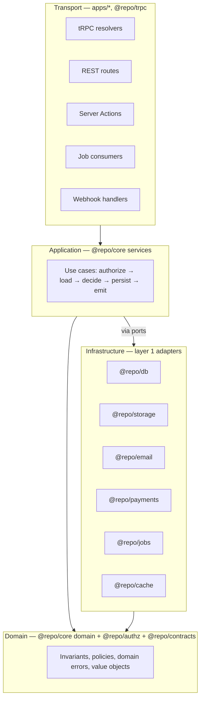
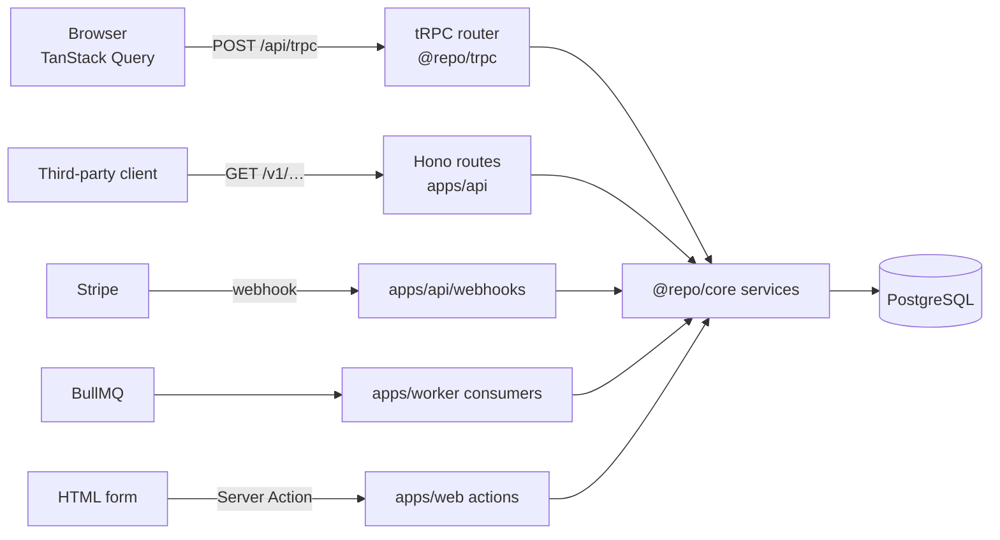

# 05 — Runtime architecture & API strategy

---

## 1. Clean architecture, as actually practised

The textbook diagram has four rings. Applied literally to a TypeScript product monorepo it
produces ceremony without benefit. What we keep is the one rule that pays for itself:

> **Business rules do not depend on delivery mechanisms or infrastructure. Dependencies point
> inward. Anything that crosses a process boundary is behind a port.**

What we drop: an interface for every dependency, entity/DTO duplication at every layer, and a
"use case class" per operation.

### The four concentric responsibilities



The load-bearing consequence: **there are five transports and one implementation of every rule.**
A rule such as "an invoice cannot be voided after payment" exists in exactly one function, and
the web UI, the public API, a background job, and a Stripe webhook all reach it.

### What each layer may do

| Layer                 | May                                                                                            | May not                                                     |
| --------------------- | ---------------------------------------------------------------------------------------------- | ----------------------------------------------------------- |
| Transport             | Parse input, resolve actor, call one service, map result/errors to the wire, set cache headers | Contain a business rule, query the DB, decide authorization |
| Application (service) | Authorize, orchestrate, transact, emit events, call ports                                      | Know about HTTP, React, tRPC, or queue mechanics            |
| Domain                | Enforce invariants, compute, decide                                                            | Perform any I/O                                             |
| Infrastructure        | Talk to the outside world                                                                      | Contain a business rule                                     |

### The canonical service shape

Every service follows the same five beats, in this order. Consistency here is what makes an
unfamiliar feature readable in thirty seconds:

```
async function voidInvoice(ctx, input) {
  // 1. AUTHORIZE  — deny by default, using the actor on ctx
  // 2. LOAD       — fetch aggregates through the feature repository
  // 3. DECIDE     — pure domain logic; throws typed domain errors
  // 4. PERSIST    — write, transactionally, with the outbox if events must not be lost
  // 5. EMIT       — domain events → analytics, jobs, cache invalidation
}
```

Authorization is first so that an unauthorized caller cannot learn whether a resource exists
through timing or error differences.

---

## 2. API strategy

Two API surfaces with genuinely different requirements. Trying to serve both with one surface is
the mistake this design avoids.

|                  | Private API                                      | Public API                              |
| ---------------- | ------------------------------------------------ | --------------------------------------- |
| Consumer         | Our own web app (and future first-party clients) | Third parties, customer integrations    |
| Technology       | tRPC 11                                          | Hono + `@hono/zod-openapi`              |
| Transport        | HTTP POST batch, JSON + SuperJSON                | REST/JSON                               |
| Auth             | Session cookie                                   | API key / bearer token, scoped          |
| Versioning       | None — deployed together with the client         | `/v1`, with a deprecation policy        |
| Contract         | TypeScript types, compile-time                   | OpenAPI 3.1 document, runtime-validated |
| Breaking changes | Free (single deploy)                             | Expensive (never within a major)        |
| Casing           | `camelCase`                                      | `snake_case`                            |
| Rate limits      | Generous, abuse-oriented                         | Per-key quotas                          |

They share: `@repo/contracts` Zod schemas, `@repo/core` services, the `AppError` hierarchy, and
authorization policies. They differ only in framing.



### 2.1 Private API — tRPC

**Why tRPC:** the client and server ship together, so a compile-time contract is strictly better
than a runtime one. No codegen step, no schema drift window, and refactors propagate as type
errors. TanStack Query integration gives caching, invalidation, and optimistic updates for free.

Structure:

- `@repo/trpc` owns `initTRPC`, the `Context` type, and the procedure builders.
- Procedures are layered, so authorization is structural rather than remembered:
  - `publicProcedure` — no actor.
  - `protectedProcedure` — requires an authenticated actor.
  - `orgProcedure` — requires an active organization membership; puts a tenant-scoped `ctx` in
    place so queries cannot forget the tenant filter.
- One router file per feature, merged in `apps/web/src/server/router.ts`.
- Input **and** output schemas are declared from `@repo/contracts`. Output schemas are not
  optional: they are what stops an internal field from silently entering a response.
- The error formatter converts `AppError` → `TRPCError` with the stable code preserved in `data`,
  so the client can map codes to localized messages.
- SuperJSON as the transformer, for `Date`, `Map`, `Set`, and `undefined` fidelity.

Resolvers stay under ~15 lines. A resolver that grows is a service that was not written.

### 2.2 Public API — REST + OpenAPI

**Why REST rather than exposing tRPC:** tRPC's wire format is an implementation detail (batching,
SuperJSON, POST-for-reads) and coupling third parties to it makes internal refactors breaking
changes for customers. Public consumers need caching semantics, ordinary HTTP verbs, generated
SDKs, and a spec their tooling understands.

**Why Hono:** small, fast, Web-standard `Request`/`Response`, and `@hono/zod-openapi` derives the
OpenAPI 3.1 document _from the same Zod schemas used for validation_. The spec cannot drift from
the implementation because there is no second source of truth. It also runs anywhere, which keeps
the deployment story open.

Conventions:

| Aspect            | Decision                                                                                                                                                                 |
| ----------------- | ------------------------------------------------------------------------------------------------------------------------------------------------------------------------ |
| Versioning        | URL prefix `/v1`. New major only for genuinely breaking changes; additive changes ship in place.                                                                         |
| Deprecation       | `Deprecation` and `Sunset` headers, a changelog entry, minimum 6 months' notice, and usage telemetry per key so we know who to contact.                                  |
| Errors            | RFC 9457 `application/problem+json`: `{ type, title, status, detail, code, errors?, request_id }`. `code` is the stable contract; `detail` is human text and may change. |
| Pagination        | Cursor-only: `?limit=&cursor=` → `{ data, next_cursor }`. Opaque, signed cursors.                                                                                        |
| Idempotency       | `Idempotency-Key` on all mutations; key + request hash + response stored in Redis (24 h) and replayed on retry. Non-negotiable for a payments-adjacent API.              |
| Rate limiting     | Per API key, sliding window in Redis, `RateLimit-*` headers, `429` + `Retry-After`.                                                                                      |
| Filtering/sorting | Explicit allowlist per resource. No arbitrary query DSL — it becomes a permanent contract and a query-planner hazard.                                                    |
| Field selection   | `?fields=` allowlist where payloads are large.                                                                                                                           |
| Partial updates   | `PATCH` with merge semantics; `exactOptionalPropertyTypes` makes "absent vs null" tractable in types.                                                                    |
| Webhooks out      | Signed (HMAC-SHA256, timestamped), retried with exponential backoff via BullMQ, replayable from the dashboard.                                                           |

**Spec as a tested artifact.** `openapi.json` is generated and **committed**. CI regenerates it
and fails if the working copy differs, then diffs it against the previous release to detect
breaking changes. The spec is the contract, so it gets the same treatment as code.

**Scalar** renders the reference, mounted in `apps/api` and embedded in `apps/docs`.

### 2.3 Server Actions

Used for form mutations where progressive enhancement matters (auth flows, settings). Rules:

- An action is a transport: `parse → resolve actor → call service → revalidate → return typed
result`.
- Every action re-validates input server-side with the same schema the form used. Client
  validation is UX, never a security control.
- Actions return a typed result rather than throwing, so forms can render field errors.
- Never used as a general-purpose RPC. If it is not a form, it is a tRPC mutation.

### 2.4 Webhook ingestion

Inbound webhooks (Stripe today) live in `apps/api` because Hono gives clean raw-body access for
signature verification. The handler: verify signature → check event id for replay → enqueue →
return 200 fast. Processing happens in a worker, because a slow webhook handler causes provider
retries and duplicate side effects.

---

## 3. Request lifecycle

The full path for an authenticated mutation, which is the path most bugs live on:

```mermaid
sequenceDiagram
    participant B as Browser
    participant P as proxy.ts (Node)
    participant R as tRPC handler
    participant C as Context builder
    participant S as core service
    participant Z as authz policy
    participant D as PostgreSQL
    participant Q as BullMQ

    B->>P: POST /api/trpc/invoice.void (cookie)
    P->>P: Locale + cookie presence only. No authorization.
    P->>R: forward
    R->>C: build Ctx
    C->>C: verify session (Better Auth), load actor + memberships
    C->>C: create request logger + trace span + request id
    R->>R: parse input (Zod). Reject 400 on failure.
    R->>S: voidInvoice(ctx, input)
    S->>Z: can(actor, "invoice:void", invoice)
    Z-->>S: allow / deny → ForbiddenError
    S->>D: load invoice (tenant-scoped)
    S->>S: domain decision → typed error if invalid
    S->>D: BEGIN; update invoice; insert outbox row; COMMIT
    S->>Q: enqueue from outbox
    S-->>R: Invoice DTO
    R-->>B: JSON (or problem+json with stable code)
```

Points that matter:

1. **`proxy.ts` never authorizes.** It runs before session verification against the database and
   is easy to reason about wrongly. It does locale resolution, redirects for obviously-anonymous
   traffic (cookie absent), and security headers. Even though Next 16 runs it on Node — so it
   _could_ query the database — it deliberately does not: an authorization check in the proxy is
   invisible from the service it protects, and any route reachable another way is then
   unprotected.
2. **The actor is resolved once per request** and carried on `ctx`. No service re-reads the
   session.
3. **The transaction wraps state change and outbox insert together**, so an event cannot be lost
   after a commit or emitted after a rollback.
4. **Every response carries a request id**, also attached to logs, spans, and Sentry events.

---

## 4. Caching layers

Four distinct caches, each with an explicit owner and invalidation strategy. Undocumented caches
are how stale data reaches users.

| Layer              | Technology                     | Contents                                                        | Invalidation                                                  |
| ------------------ | ------------------------------ | --------------------------------------------------------------- | ------------------------------------------------------------- |
| CDN                | Cloudflare                     | Static assets, marketing pages                                  | Immutable hashed filenames; purge on deploy                   |
| Full/partial route | Next `use cache` + `cacheLife` | RSC output for cacheable segments                               | `revalidateTag(tag, profile)`, `updateTag(tag)` in Actions    |
| Application        | Redis (`@repo/cache`)          | Expensive query results, entitlements, rate limits, idempotency | Explicit tag invalidation on domain events; TTL as a backstop |
| Client             | TanStack Query                 | Server state in the browser                                     | Query-key invalidation after mutations                        |

Rules: cache reads, never writes. Every cached value has a TTL even when it also has explicit
invalidation — a missed invalidation should self-heal rather than persist forever. Tenant-scoped
data always includes the tenant in the cache key, and `@repo/cache` refuses keys without a
namespace, which prevents the worst possible bug in a multi-tenant system. Cache stampedes are
handled with a short lock plus stale-while-revalidate.

---

## 5. Error handling strategy

### The model

- One base class in `@repo/errors`: `AppError`, carrying `code` (stable, `SCREAMING_SNAKE_CASE`),
  `httpStatus`, `severity`, `expose` (is the message safe for clients), `context` (structured,
  redactable), and `cause`.
- Subclasses for the recurring shapes: `ValidationError`, `UnauthorizedError`, `ForbiddenError`,
  `NotFoundError`, `ConflictError`, `RateLimitError`, `ExternalServiceError`, `InternalError`.
- Features add their own: `InvoiceAlreadyPaidError extends ConflictError` with
  `code: "INVOICE_ALREADY_PAID"`.
- Error codes are a **public contract**, versioned like an API. Registered in one place, never
  renamed, and used as i18n keys for user-facing messages.

### Throw or return?

**Core throws typed errors; transports catch and map.** We considered `Result<T, E>`
(`neverthrow`) and rejected it: it makes every signature in every layer generic, forces
`.andThen` chains through orchestration code that reads perfectly well with `await`, and its
benefit — exhaustive error handling — is only realised if every layer participates. Rejecting it
is a deliberate trade of theoretical exhaustiveness for readable orchestration code.

The one place we _do_ return values instead of throwing: Server Actions, which return
`{ ok: false, errors }` because forms need field-level errors as data, not exceptions.

### Mapping at each boundary

| Boundary      | Mapping                                                                                             |
| ------------- | --------------------------------------------------------------------------------------------------- |
| tRPC          | `errorFormatter` → `TRPCError` with `code` and safe message in `data`                               |
| REST          | `onError` → RFC 9457 problem+json with `code`, `request_id`                                         |
| Server Action | `{ ok: false, code, fieldErrors }`                                                                  |
| Job consumer  | Retryable vs terminal classification: terminal errors go straight to DLQ instead of burning retries |
| React         | `error.tsx` per segment + `global-error.tsx`; error codes map to localized messages                 |

### Rules

1. **Never swallow.** No empty `catch`. Handle, wrap with context, or let it propagate.
2. **Wrap, don't replace.** Always set `cause` when re-throwing, so stack traces survive.
3. **Log once, at the boundary.** Logging at every level produces five lines per error and hides
   the real one.
4. **Never leak internals.** `expose: false` errors return a generic message plus the request id;
   the detail goes to logs and Sentry only.
5. **Only unexpected errors go to Sentry.** A `ValidationError` is not an incident; alert fatigue
   is what makes real incidents invisible.
6. **Expected failures are typed; bugs are not.** A programmer error (`invariant` violation)
   becomes `InternalError` and is always reported.

---

## 6. Runtime shape of each app

| App      | Process model                                           | Health                                                     | Shutdown                                                             |
| -------- | ------------------------------------------------------- | ---------------------------------------------------------- | -------------------------------------------------------------------- |
| `web`    | Next standalone server, Node 24                         | `/api/health` (liveness), `/api/health/ready` (DB + Redis) | SIGTERM → stop accepting, drain, exit                                |
| `api`    | Hono on `@hono/node-server`                             | `/health`, `/health/ready`                                 | Same                                                                 |
| `worker` | Long-running Node process, no HTTP except a health port | `/health` on an internal port                              | SIGTERM → stop pulling jobs, finish in-flight (bounded), close Redis |
| `docs`   | Static export or Next server                            | `/health`                                                  | —                                                                    |

Graceful shutdown is implemented on day one, not retrofitted: without it, every deploy drops
in-flight requests and re-runs partially completed jobs, and the resulting bugs are attributed
to anything but the deploy.

Concurrency and pool sizing are configuration, not code: `DB_POOL_MAX` per app, worker
concurrency per queue. `web` and `api` share a database that has a finite connection limit, so
pool sizes are documented together with the deployment topology
([11](./11-infrastructure-and-deployment.md)) — exhausting Postgres connections is the most
common self-hosted outage.
