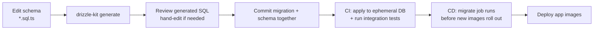
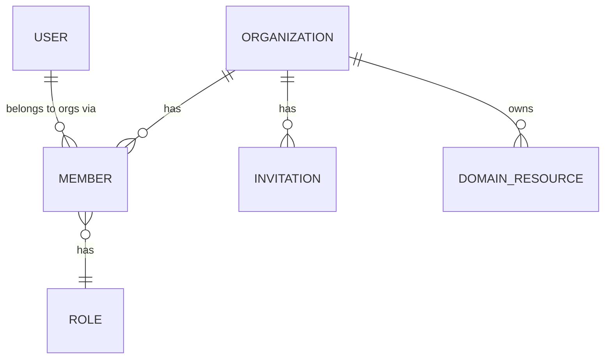
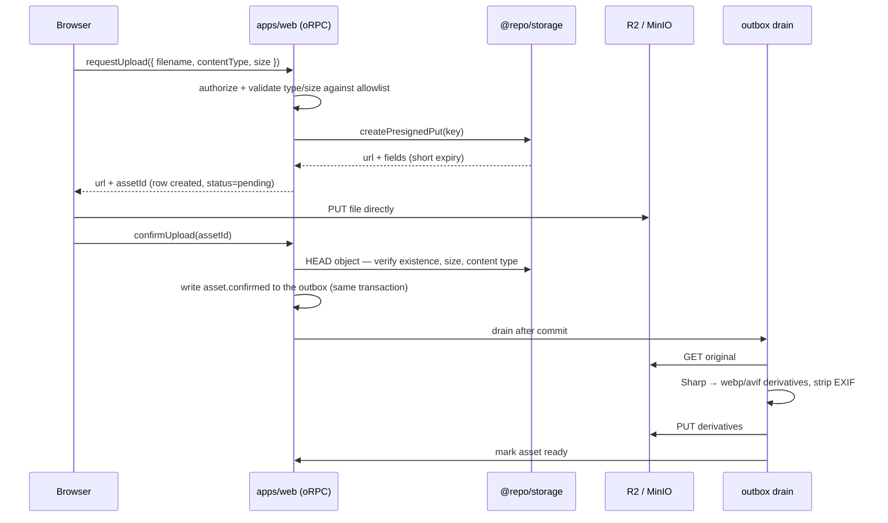

# 06 — Data, persistence & storage

---

## 1. Database strategy

**PostgreSQL 18, one logical database, one `public` schema, modules separated by table naming.**

### Why one schema rather than schema-per-module

Postgres schemas look like a tidy way to enforce module boundaries, but they impose real costs:
cross-schema foreign keys and joins become awkward, `search_path` becomes a source of subtle
bugs, migration tooling support is uneven, and connection poolers add another dimension of
confusion. Table-name prefixes give the same readability with none of that. Boundaries are
enforced in code, where they are actually checkable ([03](./03-package-graph-and-boundaries.md)),
not in the database.

### Why PostgreSQL and nothing else

Postgres is the only mainstream database that credibly replaces four services at our scale:
relational storage, JSON documents (`jsonb`), full-text search (`tsvector`), and queue-adjacent
patterns (`SKIP LOCKED`) — plus `pgvector` if embeddings are ever needed. Every managed provider
supports it, so it does not lock us to a vendor. The default should be one boring database until
measurements say otherwise.

### Conventions

Detailed in [04](./04-conventions.md#5-database-conventions). The two worth expanding:

**UUIDv7 primary keys.** Sequential integers leak volume and enable enumeration; UUIDv4 destroys
B-tree locality, which shows up as write amplification and cache misses at scale. UUIDv7 is
time-ordered, so it has v4's opacity with sequential insert locality. PostgreSQL 18 provides
`uuidv7()` natively, so it is a column default; ids are also generated application-side (via the
injected `IdGenerator` port) when a value is needed before insert, which keeps tests
deterministic.

**Money as integer minor units plus a currency column.** Floating-point money is a bug with a
delayed fuse, and `numeric` invites accidental float conversion in JavaScript. Integers plus an
explicit currency, formatted only at the presentation edge via `Intl.NumberFormat`.

### Drizzle usage

- Schema in `packages/db/src/schema/<module>.sql.ts`, one file per module, aggregated in an index.
- Public DTOs are **hand-written Zod schemas in `@repo/contracts`**, not derived from the table.
  A table-derived schema is not an API contract: exposing it means every column addition changes
  the API, and internal fields leak by default.
- Repository functions per feature. No generic repository interface (see
  [03](./03-package-graph-and-boundaries.md#4-ports-and-adapters--applied-narrowly)).
- Relational queries for reads that map cleanly to the object graph; explicit joins where the
  query shape matters. `EXPLAIN` is run on any query touching a table expected to exceed ~100 k
  rows, and the plan is noted in the PR.
- Transactions via a single `withTransaction(ctx, fn)` helper that puts the transaction on `ctx`,
  so nested calls join the existing transaction instead of opening a second connection and
  deadlocking against themselves.

### Connection management

| Setting                     | Value                                                              | Reason                                                                                  |
| --------------------------- | ------------------------------------------------------------------ | --------------------------------------------------------------------------------------- |
| Driver                      | `postgres.js` over TCP                                             | Portable across every provider; no vendor driver in application code                    |
| Pool per process            | `DB_POOL_MAX`, default 10                                          | Bounded: `web` + `api` + `worker` replicas must sum below the server limit              |
| Statement timeout           | 10 s default, overridable per query                                | An unbounded query is an outage                                                         |
| Idle-in-transaction timeout | 30 s                                                               | Prevents a leaked transaction from holding locks forever                                |
| Pooler                      | PgBouncer (self-hosted) or the provider's pooler, transaction mode | Serverless/scaled deployments need it; transaction mode means no session-level features |

Neon is the default managed provider, chosen mainly for **database branching per pull request** —
a genuinely differentiated CI capability (every PR gets a real database seeded from production
schema). But it is accessed through `DATABASE_URL` with the standard driver, so switching to RDS,
Cloud SQL, Supabase, or a self-hosted Postgres is a configuration change. Neon's HTTP/WebSocket
serverless driver is deliberately **not** the default: it would tie application code to one
vendor for a benefit (edge latency) we do not need, since nothing of ours runs at the edge.

---

## 2. Migration strategy

**Migrations are reviewed SQL files in Git, applied by an explicit job. Never on application
boot.**

### Flow

Rules:

1. **`drizzle-kit push` is local-development only.** It is in `make db-push` for rapid iteration
   and absent from every deployed path.
2. **Generated SQL is reviewed, not trusted.** Generators produce destructive statements for
   renames (drop + add = data loss) and miss `CONCURRENTLY` on indexes. Every migration is read
   by a human, and migration files are in `CODEOWNERS`.
3. **Migrations run as a separate job**, not in an app entrypoint. Boot-time migration means N
   replicas racing, and a failed migration taking the app down with no rollback path.
4. **Forward-only.** No `down` migrations: they are almost never tested and almost never work
   under load. Recovery is a new forward migration plus point-in-time restore.
5. **Every migration is backward compatible with the currently running code**, because during a
   rollout both versions serve traffic.

### Zero-downtime: expand/contract as the default

| Change          | Wrong way             | Our way                                                                           |
| --------------- | --------------------- | --------------------------------------------------------------------------------- |
| Rename a column | `ALTER … RENAME`      | Add new → backfill → dual-write → switch reads → drop old (4 deploys)             |
| Add `NOT NULL`  | `ADD COLUMN NOT NULL` | Add nullable → backfill in batches → add constraint `NOT VALID` → `VALIDATE`      |
| Add an index    | `CREATE INDEX`        | `CREATE INDEX CONCURRENTLY` in its own migration (it cannot run in a transaction) |
| Drop a column   | Drop immediately      | Stop reading → deploy → drop in a later release                                   |
| Change a type   | `ALTER TYPE`          | New column + backfill + switch                                                    |

Long backfills are jobs, not migrations: a migration holding a lock for ten minutes is an outage.
Migrations take locks; jobs take time.

### Seeds

Three tiers, explicitly separated because mixing them is how test fixtures end up in production:
`seed:reference` (required lookup data, runs in every environment), `seed:dev` (a realistic
local dataset), `seed:test` (minimal deterministic fixtures for E2E).

---

## 3. Multi-tenancy

**Shared schema, `organization_id` discriminator, enforced by scoped query helpers, with RLS
available as optional defence in depth.**

### The model

Every tenant-scoped table carries `organization_id`, `NOT NULL`, foreign-keyed with
`ON DELETE CASCADE`, and it is the **leading column of composite indexes** — because every query
filters on it, and a trailing tenant column means the index cannot be used for tenant isolation.

### Enforcement: make forgetting impossible

The catastrophic bug in multi-tenant systems is a query missing its tenant filter. Three layers
guard it:

1. **A tenant-scoped context.** `orgProcedure` puts a `TenantCtx` on `ctx` containing a resolved
   `organizationId`. Repository functions for tenant-scoped tables take `TenantCtx`, not `Ctx`, so
   **calling one without a tenant is a type error.** This is the primary defence, and it is free.
2. **Query helpers.** `scopedSelect(tenantCtx, table)` applies the filter, so the common path
   cannot omit it.
3. **Row-Level Security, optionally.** Policies keyed on a session variable set per transaction.

RLS is _available but off by default_, and that deserves justification: with a transaction-mode
pooler, the per-session `SET` must happen inside every transaction or it silently applies to the
wrong connection — a failure mode that is worse than no RLS because it looks like it is working.
It also complicates migrations and background jobs that legitimately cross tenants. The
recommendation is to enable RLS when handling regulated data, having first pinned down the
pooling model. Types are a cheaper, more reliable primary control.

### Cross-tenant access

The intended pattern for admin and support paths that must cross tenants is an explicit system
actor, a separate repository function, and an audit-log entry rather than an ambient capability.
`writeAuditLog` exists and invoice voiding uses it. No cross-tenant support path is implemented
yet. Any such path must add the capability and its transactional audit write together.

---

## 4. Caching (Redis)

`@repo/cache` wraps ioredis and refuses to be used sloppily:

- **Namespaced keys are mandatory**: `<env>:<namespace>:<version>:<key>`. The API takes a
  namespace argument; there is no way to write an unprefixed key. The `version` segment allows a
  whole namespace to be invalidated by bumping one number, which is how you recover from a bad
  cache shape without a flush.
- **Tenant id is part of the key** for anything tenant-scoped.
- **Every entry has a TTL.** No infinite entries, even with explicit invalidation, so a missed
  invalidation self-heals.
- **Stampede protection**: short lock + stale-while-revalidate for expensive recomputations.
- **Cache is never the source of truth.** Redis loss must be a latency event, not a correctness
  event. This is asserted by a test that runs a critical path with the cache disabled.

Redis also backs rate limiting, the Stripe webhook replay guard, outbox side-effect claims, and
Better Auth's secondary storage. It is configured with `maxmemory-policy: noeviction`. That is not
a cache setting — it is there because evicting a replay guard or a side-effect claim silently turns
an at-most-once guarantee into a duplicate email.

---

## 5. Object storage

**S3 API only.** `@aws-sdk/client-s3` against Cloudflare R2 in production and MinIO locally, with
identical code paths. R2 is chosen for zero egress fees and Cloudflare integration; the S3 API
means moving to S3, B2, or self-hosted MinIO is a config change.

### Upload flow — presigned, direct from the browser

Rules:

1. **Bytes never pass through the application.** Proxying uploads burns memory and request time
   and caps file size at your body-parser limit.
2. **Content type and size are validated server-side** on the presign request _and_ verified via
   `HEAD` after upload. A client-declared content type is a suggestion.
3. **Keys are structured and never user-controlled**:
   `<env>/<org-id>/<entity>/<uuidv7>/<slugified-name>`. User-supplied paths are a traversal and
   collision hazard.
4. **Buckets are private.** Reads go through presigned GETs or a signed CDN path, so access
   control stays in the application.
5. **EXIF is stripped** from user images — it commonly carries GPS coordinates.
6. **Sharp is CPU-bound and now runs on the request path.** With no worker
   ([ADR-0014](../adr/0014-single-transport-and-no-background-worker.md)), derivation happens in
   the outbox drain of whichever request picks the row up, so it competes with that request's event
   loop. `@repo/storage/image` and `@repo/assets/derive` are still kept off the default import
   graph so libvips is not loaded unless derivation actually runs — but "never in the request path"
   is no longer true, and this is the clearest candidate for reintroducing a worker.
7. **Every asset has a database row** with status (`pending`/`ready`/`failed`), owner, and tenant.
   The database is the source of truth; the bucket is storage.
8. **Orphan reconciliation is not implemented.** Presigned uploads that are never confirmed are
   inevitable, and reaping them was a nightly job. With nothing to run a schedule, the reaper was
   removed rather than left as dead code — adopters who care must run it themselves.

---

## 6. Async work

**There is no queue and no worker process.** BullMQ, `@repo/jobs`, the `JobQueue` port, and
`apps/worker` were removed in
[ADR-0014](../adr/0014-single-transport-and-no-background-worker.md), which supersedes
[ADR-0009](../adr/0009-bullmq-only-background-work.md) and
[ADR-0010](../adr/0010-bullmq-6-pluggable-backends.md).

**The transactional outbox stayed**, because it is the part that carries the guarantee. Enqueueing
inside a transaction that later rolls back schedules work that never happened; doing it after
commit loses the work if the process dies in between. So a slice writes an outbox row in the _same
transaction_ as the state change, and delivery is a separate concern.

What changed is delivery. `relayOutboxBatch` claims pending rows with `for update skip locked`,
runs a handler, and marks the row published — all in one transaction. Handlers come from an
`OutboxHandlers` registry that the composition root supplies, so the kernel names no slice
(that inversion was a precondition for [ADR-0013](../adr/0013-kernel-and-slice-packages.md)). The
drain runs in `apps/web` after a mutating request commits.

### What this costs

1. **A row is only picked up when a later request arrives.** An event written by the last request
   of the day is delivered by the first request of the next one. If that is not acceptable, run
   `relayOutboxBatch` from an external scheduler — the handler registry is the same.
2. **No retry escalation and no dead-letter queue.** A failed handler backs off (30s by default)
   and is retried by whichever request drains next. Nothing gives up, and nothing alerts.
3. **Nothing runs on a schedule.** There is no cron.
4. **Side effects share the request's event loop.** A slow SMTP server or a slow Sharp call is
   user-visible latency.

### Rules that still hold

1. **Idempotent handlers, always.** The relay claims a row transactionally, so a row is normally
   delivered once — but it is redelivered when a handler throws _after_ its side effect landed. The
   handlers guard against that with a Redis claim keyed on the outbox id before doing the work.
2. **Small payloads: identifiers, not documents.** The handler re-reads current state, otherwise a
   retry acts on a stale snapshot.
3. **Payloads are re-validated with Zod on read.** An outbox row is `jsonb` written by a possibly
   older deploy of this code, which makes it external input by the time it is read back.
4. **A handler with no registered event type is skipped and marked published**, not retried
   forever. The row has been seen and nothing wants it.
5. **Terminal conditions are logged and swallowed, not retried.** No owner to email, or a missing
   source object, cannot be fixed by trying again.

---

## 7. Backup & recovery

Untested backups are not backups. Both are exercised, and the drill is part of the release
checklist.

| Asset          | Method                                                               | Retention                | Verification                                                                         |
| -------------- | -------------------------------------------------------------------- | ------------------------ | ------------------------------------------------------------------------------------ |
| PostgreSQL     | Managed PITR (Neon) or `pg_dump` + WAL archiving to R2 (self-hosted) | 30 days PITR, 12 monthly | Monthly automated restore into a scratch database, then run migrations + smoke tests |
| Object storage | R2 versioning + lifecycle rules                                      | 30 days for deletions    | Quarterly spot restore                                                               |
| Redis          | None (deliberately)                                                  | —                        | Asserted by a test that critical paths work with an empty cache                      |
| Secrets        | `age` keys in an offline password manager, plus a printed copy       | —                        | Documented recovery drill in the runbook                                             |

Redis is explicitly not backed up: treating it as durable is how a cache becomes a database by
accident. Targets: **RPO ≤ 5 minutes, RTO ≤ 1 hour**, with the restore procedure written as a
runbook rather than improvised during an incident.
