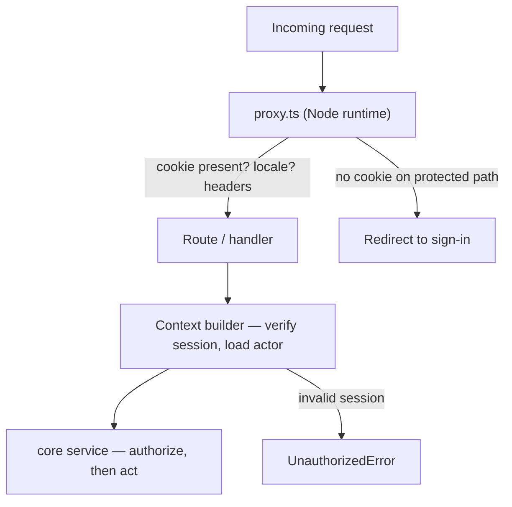

# 07 — Authentication & authorization

Authentication answers _who is calling_. Authorization answers _what they may do_. They are
separate packages here because conflating them is how "logged in" quietly becomes "permitted".

---

## 1. Authentication

**Better Auth 1.6, self-hosted, owning its own tables in our PostgreSQL database.**

### Why Better Auth

| Criterion           | Assessment                                                                                                                                           |
| ------------------- | ---------------------------------------------------------------------------------------------------------------------------------------------------- |
| Ownership           | Auth tables live in _our_ database. Users, sessions, and accounts are ours — no vendor holds the identity graph.                                     |
| Self-hostable       | No external service required. Works offline and air-gapped.                                                                                          |
| TypeScript-native   | Fully typed server config and client, with plugin types flowing through to call sites.                                                               |
| Drizzle integration | First-class adapter; schema is generated into our migrations rather than managed opaquely.                                                           |
| Scope               | Sessions, OAuth, email/password, magic links, passkeys, 2FA, API keys, and organizations/RBAC are all covered by maintained plugins.                 |
| Exit cost           | Moderate and bounded: the tables are readable SQL. Password hashes and OAuth links are portable. Compare to a hosted IdP, where export is a project. |

Alternatives and why not:

- **NextAuth/Auth.js** — the adapter model treats your database as a foreign store; multi-tenancy,
  API keys, and RBAC are all left to you; and the v4→v5 transition demonstrated how much churn a
  thin abstraction over many providers carries.
- **Clerk / WorkOS / Auth0** — excellent products, wrong shape for this repo. They hold the
  identity graph, price per user, and make self-hosting impossible. That directly contradicts the
  cloud-agnostic principle.
- **Supabase Auth** — good, but it comes attached to Supabase.
- **Rolling our own** — sessions are easy; correct password reset, email enumeration resistance,
  OAuth edge cases, passkey ceremonies, and 2FA recovery are not. This is exactly the "genuinely
  hard problem" the dependency bar is for.

### Session model

**Database sessions with an encrypted cookie cache** — not stateless JWTs.

|                    | Choice                                                                          | Why                                                                                                                                         |
| ------------------ | ------------------------------------------------------------------------------- | ------------------------------------------------------------------------------------------------------------------------------------------- |
| Web clients        | HTTP-only, `Secure`, `SameSite=Lax` cookie referencing a database session       | Revocable immediately. A stolen JWT is valid until it expires; a database session is killed on logout, password change, or an admin action. |
| Performance        | Better Auth's cookie cache carries a short-lived signed snapshot of the session | Avoids a database round trip on every request without giving up revocability                                                                |
| Lifetime           | 30-day session, 24-hour refresh, absolute 90-day cap                            |                                                                                                                                             |
| Rotation           | On privilege change and on password change; all other sessions invalidated      |                                                                                                                                             |
| Public API         | API keys (hashed at rest, scoped, expiring), `Authorization: Bearer`            | Different consumer, different lifecycle                                                                                                     |
| Service-to-service | Short-lived signed internal tokens, never a shared static secret                |                                                                                                                                             |

Stateless JWTs are rejected for browser sessions because the property people want from them
(no database lookup) is achievable with the cookie cache, while the property they lose
(revocation) is a security requirement.

### Enabled methods

| Method              | Notes                                                                                       |
| ------------------- | ------------------------------------------------------------------------------------------- |
| Email + password    | Argon2id hashing (Better Auth default), mandatory verification, breach-list check on signup |
| OAuth               | GitHub + Google out of the box; adding a provider is configuration                          |
| Magic link          | Passwordless option, single-use, short expiry                                               |
| Passkeys / WebAuthn | Phishing-resistant, increasingly expected in 2026                                           |
| TOTP 2FA            | With single-use recovery codes                                                              |

Security defaults that ship enabled: rate limiting on all auth endpoints (per IP and per
identifier), constant-time responses on login and password reset to resist user enumeration,
single-use tokens with short expiry, secure cookie attributes, and CSRF protection on
state-changing form posts. Authentication-event audit writes are not wired yet; see
[Audit log](#audit-log).

### Where session verification happens



**`proxy.ts` does not authenticate and does not authorize.** It checks cookie _presence_ to avoid
rendering an authenticated shell for obviously anonymous traffic, resolves locale, and sets
security headers. Real verification happens in the context builder, and real authorization
happens in the service.

Next 16 runs `proxy.ts` on the Node runtime, so it _could_ query the database. It deliberately
does not, for two reasons: an authorization decision made in the proxy is invisible from the
service it protects (so any other path to that service is unguarded), and it adds a database
round trip to every asset-adjacent request. Protection belongs next to the data, not next to the
router.

---

## 2. Authorization

**Two complementary mechanisms**, because neither is sufficient alone:

1. **RBAC** for coarse capabilities — "can admins invite members?"
2. **Policy functions** for record-level rules — "can this user edit _this_ invoice?"

Pure RBAC cannot express ownership, state, or relationship conditions, and every real product
needs them. Systems that try end up encoding ownership into role names
(`invoice-editor-for-org-123`), which does not scale and cannot be audited.

### RBAC via Better Auth's organization plugin

`createAccessControl` defines resources and actions; roles are sets of permissions. The built-in
roles (`owner`, `admin`, `member`) are extended with our own statements:

```
// illustrative
const statement = {
  organization: ["update", "delete"],
  member:       ["create", "update", "delete"],
  invitation:   ["create", "cancel"],
  invoice:      ["create", "read", "update", "void", "export"],
  apiKey:       ["create", "revoke", "list"],
} as const
```

Two details discovered from the plugin's behaviour that must be respected:

1. **A custom `ac` overrides the plugin's defaults.** Better Auth's own methods
   (`organization.update`, `inviteMember`, …) check specific statements internally, so the base
   actions must be re-declared or those built-in methods start returning "unauthorized" for roles
   that should have them. Custom roles are therefore composed from `adminAc`/`memberAc` rather
   than written from scratch.
2. **Dynamic access control is off by default.** Runtime, database-stored roles
   (`dynamicAccessControl: { enabled: true }`) are attractive but come with a real typing
   consequence: passing static `roles` makes role parameters a literal union, so a `string` from a
   request body will not type-check, and the workaround is casting — which erases the safety the
   union was providing. Static, code-defined roles are reviewable, diffable, and testable. We
   enable dynamic roles only if a product genuinely requires customer-authored roles, and we
   accept the typing consequences explicitly at that point.

Client-side checks use `checkRolePermission` for UI affordances only (it is synchronous and does
not see dynamic roles). **Every authoritative check happens server-side** via `hasPermission` or
our own policy layer. Hiding a button is UX; it is not access control.

### Record-level policies — `@repo/authz`

`@repo/authz` is a pure package: no database, no session, no network. It exports:

```
// illustrative
type Decision = { allowed: true } | { allowed: false; reason: string; code: ErrorCode }

can(actor: Actor, action: Action, resource?: Resource): Decision
authorize(actor, action, resource?): void   // throws ForbiddenError
```

An `Actor` is a resolved value object: `{ userId, organizationId, role, permissions, isSystem }`.
It is built once by the context builder, so policies are pure functions of data.

Policies live with their feature (`billing.policy.ts`) and compose the RBAC check with domain
conditions:

```
// illustrative
canVoidInvoice(actor, invoice) =
  hasPermission(actor, "invoice:void")
  && invoice.organizationId === actor.organizationId
  && invoice.status !== "paid"
```

Purity is what makes the authorization model exhaustively unit-testable in milliseconds — a
policy test matrix over roles × resource states is fast enough to be complete, which is not true
of tests that need a database and a session.

### The rules

1. **Deny by default.** `can()` returns denial for any unrecognised action.
2. **Authorize in the service, first.** Not in the resolver, not in the component, not in the
   proxy. Before any load or side effect.
3. **Every tenant-scoped service takes an actor.** There is no ambient "current user"; a service
   with no actor parameter cannot be tenant-safe.
4. **Authorization failures are `ForbiddenError` with a stable code.** For resources the actor may
   not even know exist, return `NotFoundError` instead, so the API does not confirm existence to
   unauthorized callers.
5. **UI checks are duplicated, never trusted.** The same permission constants drive both, so they
   cannot drift.
6. **Denials should be logged at the transport boundary** with actor, action, and resource —
   denials are a leading indicator of both bugs and attacks. That dedicated denial wiring is
   pending; `@repo/authz` currently returns typed decisions without performing I/O.
7. **Policy coverage is asserted**: a test enumerates every registered action and fails if one has
   no policy, which is how an action added without a rule gets caught rather than defaulting to
   whatever the resolver forgot.

### Impersonation and support access

Better Auth's admin impersonation can produce a distinct session, and the resolved actor preserves
its `isImpersonating` flag. `@repo/authz` bars impersonated actors from destructive actions.
Reason capture, a dedicated support UI and banner, and audit-log writes are not implemented yet;
they remain requirements before impersonation is exposed as a supported operator workflow.

---

## 3. Public API authentication

| Aspect        | Decision                                                                                                                          |
| ------------- | --------------------------------------------------------------------------------------------------------------------------------- |
| Credential    | API key: displayed once, stored as a SHA-256 hash with a short lookup prefix                                                      |
| Format        | `sk_live_<random>` / `sk_test_<random>` — prefixes make keys greppable in leak scanning and obvious in support tickets            |
| Scoping       | Intended invariant: per organization, with effective permissions equal to the key scope ∩ creator role                            |
| Expiry        | Optional, encouraged; the dashboard warns about non-expiring keys                                                                 |
| Rotation      | Overlapping keys supported so rotation needs no downtime                                                                          |
| Revocation    | Immediate; keys are cached in Redis with a short TTL and evicted on revoke                                                        |
| Observability | `last_used_at`, request counts, and per-key rate limits — so a deprecation can be communicated to the specific customers affected |

Keys resolve to the same `Actor` shape as a session, which means **`@repo/core` cannot tell
whether it is serving the web app or a third party**, and therefore cannot apply weaker rules to
one of them. That is the entire benefit of a shared actor abstraction.

The main-branch resolver does not yet enforce the intended intersection: it uses a key's explicit
scope directly (or falls back to role permissions). Treat the intersection as the required design,
not as a currently enforced guarantee, until the authorization fix and its parity tests land.

---

## 4. Threat model and mitigations

The concrete failure modes this design is built against:

| Threat                                                                | Mitigation                                                                                                              |
| --------------------------------------------------------------------- | ----------------------------------------------------------------------------------------------------------------------- |
| Cross-tenant data access                                              | Tenant column + `TenantCtx` type requirement + policy tenant check; optional RLS                                        |
| Session theft                                                         | HTTP-only `Secure` cookies, `SameSite=Lax`, rotation on privilege change, revocable DB sessions                         |
| Privilege escalation via mass assignment                              | Input schemas are explicit allowlists; `role` and `organizationId` are never accepted from request bodies               |
| Broken object-level authorization (the most common API vulnerability) | Policies take the _loaded_ resource, not an id, so the tenant check happens against real data                           |
| Credential stuffing                                                   | Rate limiting per IP and per identifier, breach-list check, passkey/2FA available                                       |
| User enumeration                                                      | Constant-time, identical responses on login/reset/signup                                                                |
| CSRF                                                                  | `SameSite` cookies + Better Auth CSRF protection on form posts; tRPC requires a custom header                           |
| Leaked API key                                                        | Prefixed keys are detected by Gitleaks and provider leak scanners; revocation is instant; scopes bound the blast radius |
| Insider access                                                        | Destructive actions are blocked while impersonating; reason capture, support UI, and audit wiring remain required       |
| Webhook forgery                                                       | HMAC signature + timestamp window + event-id replay check                                                               |
| Open redirect after login                                             | `returnTo` validated against a same-origin allowlist                                                                    |

### Audit log

**Schema-ready, not operational.** The initial migration includes an `audit_log` table with
tenant, actor, action, resource, metadata, and timestamp fields, but application services do not
write audit rows yet. Authentication events, permission and role changes, membership changes,
API-key lifecycle, impersonation, billing changes, destructive deletes, and cross-tenant system
access are therefore not currently recorded there.

When wiring is added, writes must share the transaction of the change they describe, metadata
must be redacted, and tenant querying and retention need explicit implementation. Until then,
the schema is preparation for an audit feature, not evidence that a complete audit trail exists.
