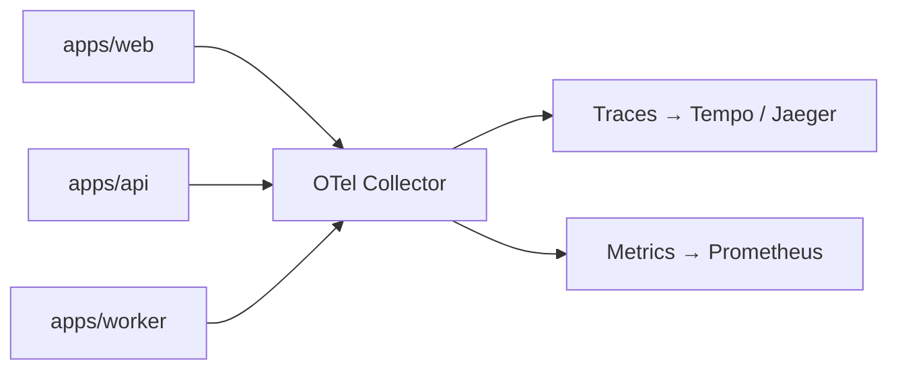

# 08 — Observability, analytics & feature flags

Error handling is covered in [05 §5](./05-runtime-and-api.md#5-error-handling-strategy). This
document covers what happens _after_ something is observed.

The organising idea: **one correlation id links everything.** Given a request id from a support
ticket, an engineer can find the log lines, the distributed trace, the job runs
it spawned, and the analytics events it produced. Observability that requires cross-referencing
timestamps by hand is not observability.

---

## 1. Logging

**Pino, structured JSON, one line per event.**

### Why Pino

The fastest mature Node logger, JSON-first (so no parsing step in the pipeline), with child
loggers, serializers, and redaction built in. Winston is slower with a heavier API surface;
`console.log` has no levels, no structure, and no redaction. Pino's asynchronous transports keep
logging off the hot path, which matters because synchronous logging under load is a real latency
source.

### Structure

Every line carries a base context, and the fields are fixed so queries are writable in advance:

| Field                         | Source                                     |
| ----------------------------- | ------------------------------------------ |
| `level`, `time`, `msg`        | Pino                                       |
| `service`                     | App name (`web`, `api`, `worker`)          |
| `env`, `version`              | Env + build metadata (git SHA)             |
| `requestId`                   | Generated per request, echoed in responses |
| `traceId`, `spanId`           | From the active OpenTelemetry context      |
| `userId`, `organizationId`    | From the actor, when authenticated         |
| `jobId`, `jobName`, `attempt` | In worker contexts                         |

`traceId` is what joins logs to traces, so it is injected by a Pino mixin reading the active OTel
context rather than being passed around manually.

### Request-scoped loggers via `AsyncLocalStorage`

A child logger is created per request with the context bound, then stored in `AsyncLocalStorage`
and placed on `ctx`. Deep code paths get the correlated logger without threading it through every
signature, and there is no global mutable logger whose context can leak between concurrent
requests.

### Levels — with an actual policy

Levels are worthless without agreed meanings, so:

| Level   | Meaning                                              | Examples                                                                       |
| ------- | ---------------------------------------------------- | ------------------------------------------------------------------------------ |
| `fatal` | The process cannot continue                          | Env validation failure, unrecoverable DB state at boot                         |
| `error` | An operation failed unexpectedly and needs attention | Unhandled exception, external service down after retries, job in DLQ           |
| `warn`  | Degraded but handled                                 | Retry succeeded, cache miss on a hot path, deprecated API used, rate limit hit |
| `info`  | Notable business or lifecycle events                 | Startup, shutdown, job completed, user signed up, payment succeeded            |
| `debug` | Developer detail, off in production                  | Query shapes, cache decisions, branch reasons                                  |
| `trace` | Very fine detail, local only                         |                                                                                |

Defaults: `info` in production, `debug` locally. Overridable per service via `LOG_LEVEL`, and
per-request via a signed debug header for support investigations — so raising verbosity for one
customer does not mean raising it for everyone.

### Rules

1. **No `console.*` in application code.** Lint error. `console` bypasses levels, structure, and
   redaction.
2. **Log objects, not interpolated strings.** `log.info({ invoiceId }, "invoice voided")`, never
   ``log.info(`voided ${id}`)``. Interpolated strings are unqueryable.
3. **Log once, at the boundary.** The transport error mapper logs the error. Intermediate layers
   add context by wrapping the error, not by logging it again.
4. **Never log secrets or PII.** A redaction list covers `password`, `token`, `authorization`,
   `cookie`, `secret`, `apiKey`, `cardNumber`, `email` (hashed instead), and nested paths.
   Redaction is configured centrally in `@repo/logger`, because per-call-site discipline fails
   eventually.
5. **The domain layer does not log.** It throws or returns; the boundary decides. This keeps
   domain functions pure and testable.
6. **Logs are events, not narration.** "About to do X" followed by "did X" doubles volume and
   halves signal.

### Transport and retention

Pino writes JSON to stdout. Docker collects it, and the log shipper (Vector or Promtail) forwards
to the aggregator (Loki self-hosted, or any provider — the format is standard, so this is a
swappable decision). `pino-pretty` is a dev-only dependency used exclusively in local scripts.
Retention: 30 days hot, 12 months of compressed archive in R2 for anything audit-relevant.

---

## 2. Tracing and metrics

**OpenTelemetry, exported via OTLP to a collector we control.**

### Why OpenTelemetry, and why a collector

OTel is the only vendor-neutral instrumentation standard, which is what makes the observability
backend a swappable decision rather than a rewrite. Instrumenting with a vendor SDK means
re-instrumenting when the vendor changes.

The collector matters as much as the SDK: applications export to a local collector, and the
collector decides where data goes (Tempo/Jaeger/SigNoz self-hosted, or a SaaS backend). Changing
backend is a collector config change and zero application changes. It also gives one place for
sampling, batching, and attribute scrubbing.



### What is instrumented

Explicit instrumentations for HTTP, Redis (ioredis), outbound fetch (undici), and Node runtime
metrics — not the auto-instrumentations meta-package (which would ship unused Mongo/AWS/Kafka
instrumentations into the api/worker images). Plus manual spans for: Postgres (`postgres.js`)
repository work, every core service call, every job execution, every external API call, and
expensive computations.

Span naming is `<layer>.<operation>` (`core.invoice.void`, `db.invoice.findById`), with attributes
for tenant, actor, and result. High-cardinality values (ids) are span **attributes**, never part
of the span name — putting ids in names is what makes trace UIs useless.

**Context propagation across queues** is explicit: the trace context is serialized into the job
payload and restored by the consumer, so a trace spans the HTTP request _and_ the background work
it triggered. Without this, every async side effect becomes an unattributed orphan.

### Sampling

Head-based, 100 % in development and staging. In production: 100 % of errors and slow requests
(above a latency threshold), plus a configurable baseline (default 10 %) of the rest. Tail-based
sampling is configured in the collector as volume grows.

### Metrics — the four that matter

RED for services (Rate, Errors, Duration) and saturation for resources. Concretely: request rate
and p50/p95/p99 latency per route, error rate by code, database pool utilisation and query
duration, queue depth and job duration and DLQ size per queue, cache hit ratio, and event-loop
lag. Business metrics (signups, subscriptions, revenue) go to PostHog, not Prometheus — mixing
system and product metrics produces dashboards nobody owns.

### Error tracking

Unexpected errors go to **Pino** at the transport boundary (`logger.error`) and, on the same
condition, to an **`ErrorTracker`**. Expected domain errors (`ValidationError`, `NotFoundError`,
`ForbiddenError`) are logged at `warn` and never reported, because an alert channel with false
positives is an alert channel nobody reads.

The split is the point: logs answer _what happened in this request_, a tracker answers _what is
broken this week_ — the same exception grouped across requests, releases and hosts, which no log
query does well.

Four boundaries report, and each was already logging:

| Boundary                                   | Reports                                            |
| ------------------------------------------ | -------------------------------------------------- |
| `apps/api/src/middleware/error-handler.ts` | any `AppError` that is not `expected`              |
| `apps/web` RPC route                       | any failure `describeRpcFailure` calls an incident |
| `apps/web` in-process caller               | the same policy, for Server Components             |
| `apps/worker` container                    | dead-lettered jobs, and DLQ failures               |

The in-process caller needs its own hook because a Server Component calls services
directly: no HTTP layer observes it, so without `reportCallerFailure` its errors would
surface as a rendered `error.tsx` and nothing else. Both web entry points run the same
`describeRpcFailure` policy, so they cannot disagree about what counts as an incident.

`SENTRY_DSN` is the whole switch. Unset selects `createNoopErrorTracker()`, which is the
supported state for local runs, CI, and self-hosted deployments without a tracker. A self-hosted
**GlitchTip** DSN works unchanged — same protocol, so the choice is a DSN and not an
architecture.

**The adapter runs Sentry in capture-only mode, deliberately.** `@sentry/node` v8+ ships its own
OpenTelemetry SDK and initialises it by default; this repo already starts a `NodeSDK` with its
own instrumentations. Two SDKs registering a global `TracerProvider` in one process is how an
earlier attempt at this went in circles. So `skipOpenTelemetrySetup: true` and
`defaultIntegrations: false` reduce Sentry to the one job OTel does not do, and
`sentry-tracker.test.ts` pins that the global provider is untouched. Tracing stays with OTel and
Jaeger.

Consequences worth knowing: **no browser errors**, no session replay, and no source maps. A
component that throws in the user's browser — a bad `onClick`, a render crash inside a
`"use client"` tree — never reaches the tracker; it renders `error.tsx` and disappears.
Server stack traces are readable because the deployed code is the built code. Covering the
browser means `@sentry/nextjs` and its build plugin, which is the part that was painful.

`capture()` never throws and shutdown flushes with a bounded timeout: a tracker outage must not
become an outage.

Alerting is on symptoms, not causes: error-rate spikes, p95 latency regressions, queue depth
growth, DLQ arrivals, and failed deploys. Every alert must be actionable and have an owner; an
alert with no runbook gets deleted rather than muted.

---

## 3. Product analytics

**PostHog, with a typed event registry in `@repo/analytics`.**

### The core decision: events are a typed contract

The universal failure of product analytics is stringly-typed `capture("button_clicked", {...})`
calls scattered across the codebase, producing an event catalog nobody can trust within a quarter.
Instead, every event is declared once with a Zod payload schema:

```
// illustrative
export const events = {
  "user.signed_up":        z.object({ method: z.enum(["password","oauth","magic_link"]) }),
  "organization.created":  z.object({ organizationId: z.string(), plan: PlanSchema }),
  "invoice.voided":        z.object({ invoiceId: z.string(), amountMinor: z.number().int() }),
} as const
```

`capture()` is generic over that registry, so an unknown event name or a malformed payload is a
**compile error**. The registry doubles as documentation, and renaming an event surfaces every
call site.

Naming: `<object>.<past-tense-verb>`, `snake_case` properties, no PII in properties (ids only).

### Client or server capture?

| Capture location                    | Use for                                                                             | Why                                                                                |
| ----------------------------------- | ----------------------------------------------------------------------------------- | ---------------------------------------------------------------------------------- |
| Server (`@repo/core` domain events) | Business-critical funnel events: signup, subscription, payment, invitation accepted | Ad blockers remove 15–30 % of client events; revenue data cannot have a hole in it |
| Client                              | UI interaction: feature discovery, navigation, dead clicks, form abandonment        | The server cannot see these                                                        |

Server-side capture is wired to **domain events**, not sprinkled into services: the service emits
`invoice.voided`, and an analytics subscriber translates it. Analytics therefore adds no lines to
business logic and can be removed entirely without touching core.

Client capture is proxied through a Next rewrite (`/ingest/*` → PostHog), which both reduces
blocker loss and avoids a third-party origin in the CSP. `proxy.ts` excludes `/ingest` from
locale prefixing and the session-cookie gate so capture is not rewritten to `/en/ingest` or
bounced to sign-in.

### Privacy

Cookie consent gates analytics loading in regions that require it; PostHog runs with
`person_profiles: "identified_only"`, autocapture off (explicit events only, since autocapture
produces exactly the untrustworthy catalog we are avoiding), session recording off by default and
enabled per-need with input masking. A self-hosted PostHog is a supported configuration for
data-residency requirements, which is a further reason to keep capture behind our own interface.

---

## 4. Feature flags

**Our own interface in `@repo/flags`, with pluggable providers. Flags are not a hard dependency.**

### Why an interface rather than using PostHog directly

Three reasons, in order of importance: flags must be evaluable **offline and in tests** (a test
suite that needs a flag service is a flaky test suite); flag evaluation appears in server
rendering paths, where a network call per flag is unacceptable; and providers change while flag
call sites are spread across the codebase, so the interface bounds the cost of switching.

Providers:

| Provider              | Use                                                                                           |
| --------------------- | --------------------------------------------------------------------------------------------- |
| `EnvFlagProvider`     | Default. Reads a JSON blob from env. Zero infrastructure, works offline, deterministic in CI. |
| `PostHogFlagProvider` | Production. Percentage rollouts, cohort targeting, experiments.                               |
| `StaticFlagProvider`  | Tests. Explicit values per test case.                                                         |

### Typed registry, with a declared kind

Flags are declared with a default, an owner, and an expiry:

```
// illustrative — the registry is empty until a real rollout needs a flag
export const flags = {
  "maintenance-mode": { kind: "kill-switch", default: false, owner: "@team" },
  "checkout-v2":      { kind: "experiment",  default: false, owner: "@team", expires: "2026-09-15" },
} as const
```

The four kinds have different lifecycles, and conflating them is why flag debt accumulates:

| Kind                                         | Lifetime       | Removal                                               |
| -------------------------------------------- | -------------- | ----------------------------------------------------- |
| Release (decouple deploy from launch)        | Days to weeks  | **Mandatory.** Removed immediately after full rollout |
| Experiment (A/B)                             | One experiment | Mandatory after the decision                          |
| Kill-switch (disable an expensive subsystem) | Permanent      | Never removed; genuinely part of operations           |
| Permission/entitlement                       | Permanent      | Not a flag at all — belongs in `@repo/authz`          |

**Stale-flag enforcement:** every non-permanent flag has an `expires` date, and CI fails when one
passes it. Without a mechanism, flags accumulate forever and every one doubles the number of code
paths that theoretically exist and are never tested.

### Evaluation rules

1. **Server-evaluated for anything affecting render.** Flags are resolved during RSC render and
   passed down, so there is no client-side flash of the wrong variant.
2. **Bootstrapped on the client** from the server-evaluated set, so client checks are synchronous.
3. **Never fail closed on provider errors.** A flag provider outage returns the declared default;
   an outage must not take the product down.
4. **Flags are not authorization.** Entitlements and permissions go through `@repo/authz`, which is
   auditable. A flag is a rollout tool.
5. **Both branches are tested.** A flagged code path with no test for the off state will break the
   moment it is turned off.

---

## 5. What "good observability" means here

The acceptance criteria, written as questions an engineer must be able to answer in minutes:

1. A customer reports an error at 14:32 with request id `req_abc`. → Find the log lines, the trace,
   the actor, and the tenant.
2. p95 latency doubled after the 15:10 deploy. → Compare traces across the two release tags and
   identify the slower span.
3. A job has been retrying for an hour. → Find its DLQ entry, payload, error, and the request that
   enqueued it.
4. A customer says emails are not arriving. → Trace from the domain event through the outbox, the
   job, and the Resend call.
5. Signup conversion dropped 10 %. → Segment the PostHog funnel by release, flag variant, and
   cohort.
6. "Is anyone still using API v1 endpoint X?" → Per-key endpoint usage, so deprecation is
   communicated to specific customers rather than announced blindly. Better Auth
   `verifyApiKey` increments `apikey.request_count` and updates `last_request` on each
   successful validation — query those columns (or expose a small admin read) to rank keys
   by traffic before deprecating a route.

If any of these requires SSH-ing into a box and grepping, the observability setup has failed and
gets fixed rather than worked around.

### Walkthrough (acceptance)

| #   | Question                                 | Where to look locally                                                                                                          |
| --- | ---------------------------------------- | ------------------------------------------------------------------------------------------------------------------------------ |
| 1   | Error at 14:32 with request id `req_abc` | Pino logs (`requestId`), Jaeger (`15443`), `ctx.actor` in oRPC context                                                         |
| 2   | p95 latency doubled after deploy         | Grafana RED dashboard (`15448`), compare `service.version` tags                                                                |
| 3   | Job retrying for an hour                 | Worker logs (`jobId`, `attempt`), Grafana Queue dashboard (`bullmq_queue_waiting`), Jaeger job span via envelope `traceparent` |
| 4   | Emails not arriving                      | Domain event → outbox table → `email.send` job → Resend span in trace                                                          |
| 5   | Signup conversion dropped                | PostHog funnel; segment by `release` property and flag variant from server bootstrap                                           |
| 6   | Who still uses REST endpoint X?          | `apikey.request_count` / `last_request` via Better Auth `verifyApiKey` (see `@repo/auth`)                                      |

**Local URLs** (after `make deps-up-observability`): Jaeger `http://127.0.0.1:15443`, Prometheus
`http://127.0.0.1:15447`, Grafana `http://127.0.0.1:15448` (admin/admin). Enable
`OTEL_ENABLED=true` and `OTEL_EXPORTER_OTLP_ENDPOINT=http://127.0.0.1:15445` in `.env`.
`make deps-up` starts Postgres, Redis, MinIO, and Mailpit only.
