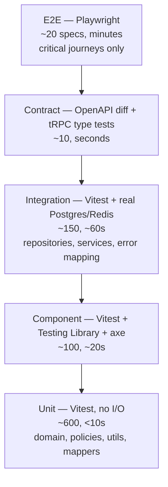

# 10 — Testing strategy

The purpose of tests here is to make change safe. A test that does not increase confidence in
changing code is a liability: it costs maintenance, slows CI, and — worst — creates false
confidence.

---

## 1. What we test, and what we refuse to test

### Test with priority

| Priority | What                                          | Level                       | Why                                                                            |
| -------- | --------------------------------------------- | --------------------------- | ------------------------------------------------------------------------------ |
| 1        | Authorization policies                        | Unit                        | A bug here is a data breach. Pure functions, so exhaustive matrices are cheap. |
| 2        | Domain rules and invariants                   | Unit                        | The reason the software exists.                                                |
| 3        | Repository queries, especially tenant scoping | Integration (real Postgres) | Where SQL and isolation bugs actually live.                                    |
| 4        | Critical user journeys                        | E2E                         | Signup, sign-in, invite, checkout, core CRUD.                                  |
| 5        | API contracts                                 | Contract                    | A breaking change to a public endpoint breaks customers.                       |
| 6        | Error mapping at boundaries                   | Integration                 | Wrong status codes and leaked internals.                                       |
| 7        | Accessibility of shared components            | Component                   | Regressions are invisible without automation.                                  |

### Deliberately not tested

| Not tested                                                             | Why                                                                                              |
| ---------------------------------------------------------------------- | ------------------------------------------------------------------------------------------------ |
| Rendered markup snapshots                                              | They fail on every intentional change and are updated without reading. Test behaviour, not HTML. |
| Third-party library behaviour                                          | Testing that Zod validates is testing Zod.                                                       |
| Trivial getters, mappers with no logic, re-exports                     | No possible failure mode.                                                                        |
| Implementation details (internal state, call counts on non-boundaries) | Cements the current implementation and blocks refactoring, which is the opposite of the goal.    |
| Generated code (Drizzle types, OpenAPI output)                         | Generation is verified once; the generator is not ours to test.                                  |
| Framework wiring already covered by an E2E test                        | Duplicate coverage at higher cost.                                                               |

### Coverage

Coverage is a **diagnostic, not a target**. Thresholds are set per package to match its risk
rather than a repo-wide number, which averages away exactly the information you need:

| Package                          | Line threshold                                   |
| -------------------------------- | ------------------------------------------------ |
| `@repo/authz`                    | 100 % — it is small, pure, and security-critical |
| `@repo/core`                     | 90 %                                             |
| `@repo/contracts`, `@repo/utils` | 90 %                                             |
| Layer 1 adapters                 | 70 % — thin wrappers over vendor SDKs            |
| `@repo/ui`                       | 60 % — behaviour and a11y, not visual            |
| `apps/*`                         | No threshold — covered by E2E                    |

Uncovered branches are reviewed for _why_, never chased for the number.

---

## 2. The pyramid

The shape is intentional: the fast layers are where behaviour is specified in detail, and the slow
layers only prove the pieces are wired together. Inverting this (many E2E tests) produces a suite
that is slow, flaky, and gives poor failure localisation.

---

## 3. Unit tests

**Vitest**, node environment, no I/O, no mocking frameworks beyond what a fake port needs.

- Core services are tested by building a `Ctx` from in-memory fakes: `InMemoryMailer`,
  `InMemoryFileStore`, `FakeClock`, `FixedIdGenerator`, `RecordingEventBus`. Fakes live in
  `@repo/testing` and are **real implementations of the ports**, not mocks — so tests assert on
  outcomes (`mailer.sent`) rather than on call counts. This is precisely what the narrow use of
  ports ([03](./03-package-graph-and-boundaries.md#4-ports-and-adapters--applied-narrowly)) buys.
- Policies are tested as matrices over roles × resource states, with a table-driven test per
  action.
- No `vi.mock` of internal modules. Mocking your own module means testing the mock and coupling the
  test to the file layout; if a dependency needs mocking, it should have been injected.
- **Time is injected** via the `Clock` port. `vi.useFakeTimers` only for timer-driven code.
- Tests are named for behaviour: `"refuses to void an invoice that is already paid"`, not
  `"voidInvoice case 3"`. The test name is the specification.

---

## 4. Integration tests

**Real PostgreSQL and Redis. No mocked database, ever.**

A mocked database tests the mock. Constraints, cascades, transaction semantics, index usage, and —
critically — tenant isolation only exist in a real database.

### Harness

- Postgres and Redis from `docker/compose.test.yaml` (or Testcontainers when isolation matters
  more than speed).
- **Migrations run once** per suite against a template database; each test then gets a fresh
  database created from that template — far faster than re-migrating.
- **Every test runs inside a transaction that is rolled back** afterwards, so tests are isolated
  and order-independent without truncation between them.
- Data is created via **factories** (`makeOrganization`, `makeInvoice`) with sensible defaults and
  explicit overrides, so a test states only what is relevant to it. Shared fixture files that many
  tests depend on become untouchable; factories do not.
- Parallelism: one database per worker.

### Mandatory tenant-isolation tests

For every tenant-scoped repository function, a test asserts that data belonging to organization B
is **not** returned to an actor in organization A. This is boilerplate, and it is written anyway,
because it is the highest-severity bug class in the system. A shared helper generates the pair of
cases so the cost is a single line per function.

---

## 5. Component tests

**Vitest (jsdom) + Testing Library + axe-core.**

- Queried by accessible role and label, never by test id or class. If a component cannot be queried
  by role, that is an accessibility finding, and the test surfacing it is doing its job.
- User interaction via `@testing-library/user-event`, which models real event sequences.
- Network via **MSW** at the boundary, not by mocking the query client — so the component's real
  fetching code runs.
- Every shared `@repo/ui` component has an axe assertion. Automated checks catch roughly 30–40 % of
  real accessibility issues; the rest is covered by a manual keyboard and screen-reader pass on new
  patterns, which is documented rather than assumed.
- Tested: behaviour, states (loading/empty/error/populated), keyboard navigation, focus management.
  Not tested: styling, exact markup.

---

## 6. Contract tests

Two mechanisms guarding the two API surfaces:

**Public REST.** `openapi.json` is generated and committed. CI regenerates it and fails if it
differs from the committed copy (so the spec can never silently drift), then runs an OpenAPI diff
against the previous release tag and fails on a breaking change unless the PR carries an explicit
`api-breaking-change` label. Additionally, response payloads in integration tests are validated
against the spec's schemas, which catches implementations that quietly diverge from what they
document.

**Internal tRPC.** Type-level tests using `expectTypeOf` assert that router input/output types match
the shared contracts. Because client and server share types at compile time, a genuine breaking
change is already a type error — these tests exist to make the failure explicit and readable.

---

## 7. End-to-end tests

**Playwright, against the real Docker stack.** Around twenty specs — enough to cover the journeys
whose failure would be an incident, and few enough to stay fast and non-flaky.

Journeys: sign up and verify, sign in (password, OAuth mocked, passkey where supported), create an
organization, invite and accept a member, the vertical-slice CRUD flow, file upload, role-based
access denial, and checkout if billing is in scope.

Anti-flake rules, which matter more than the test list:

1. **No arbitrary waits.** Web-first assertions and explicit state waits only. `waitForTimeout` is
   banned in review.
2. **Authenticate once per role** via `storageState` fixtures rather than logging in through the UI
   in every spec. Only the auth specs exercise the login form.
3. **Each spec seeds its own data** with unique identifiers and never depends on another spec's
   state or on execution order.
4. **Locators by role and label**, consistent with component tests.
5. **Email assertions go through Mailpit's API**, not by scraping a UI.
6. **Deterministic external services.** Stripe in test mode with fixed fixtures; other outbound
   calls stubbed at the network boundary.
7. **A flaky test is quarantined with an issue within one day, not retried into silence.** Retries
   are enabled in CI (2) to absorb infrastructure noise, and a test that needs them repeatedly is
   treated as a bug.
8. Traces, screenshots, and video are captured on failure and uploaded as CI artifacts, because a
   failure you cannot reproduce locally is otherwise unactionable.

---

## 8. Accessibility, load, and security testing

**Accessibility.** axe in component tests for every shared component; `@axe-core/playwright` on
every major page in E2E; keyboard-only traversal asserted on primary flows. Violations fail CI.
Target: WCAG 2.2 AA.

**Load — k6.** Not in the PR pipeline. Scenarios live in [`perf/k6/`](../../perf/k6/) and run via
`make load` (Docker `grafana/k6`, default `LOAD_BASE_URL=http://host.docker.internal:8080` after
`make prod-up`) and `.github/workflows/nightly-hardening.yml`. Scenarios: health, public API burst,
read-heavy, write-heavy and upload (soft-skip without `API_KEY`). Thresholds assert p95 latency and
error rate. The saturation point is recorded in [scaling.md](../runbooks/scaling.md).

**Security.** Automated in PR CI: Gitleaks, Renovate/`pnpm audit`, CodeQL, Trivy. OWASP ZAP
baseline nightly (`make zap`, `perf/zap/rules.tsv`). Authorization remains the security test that
matters most — see [docs/security/](../security/phase-16-review.md).

---

## 9. Local and CI execution

| Command                 | Scope                            | Duration target |
| ----------------------- | -------------------------------- | --------------- |
| `pnpm test`             | Unit + component, watch-friendly | < 30 s          |
| `pnpm test:integration` | Requires services                | < 90 s          |
| `pnpm test:e2e`         | Full stack                       | < 5 min         |
| `make check`            | Everything CI runs, same order   | < 6 min         |

In CI, jobs are parallel: lint+format, typecheck, unit+component, integration, build, then E2E
against the built images. Turborepo caching means unchanged packages are not retested, and
`--affected` limits work to what the diff touched.

`make check` exists so that "it passed locally" and "it passed in CI" mean the same thing. A CI
pipeline that cannot be reproduced locally trains people to debug by pushing commits.
