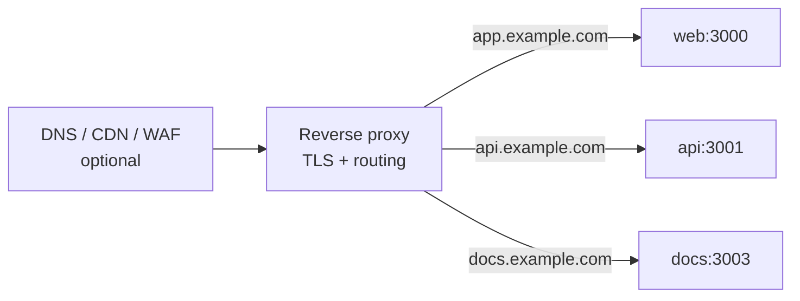
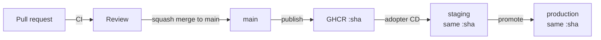

# 11 — Docker, infrastructure & deployment

---

## 1. Docker strategy

### Principles

1. **One image per app**, built once in CI, promoted unchanged through environments.
2. **Multi-stage builds** — build tooling never reaches the runtime image.
3. **Minimal, pruned build context** via `turbo prune`, so a change in `apps/api` does not
   invalidate the `apps/web` build cache.
4. **Non-root, read-only filesystem where possible, no shell in the final stage** unless required.
5. **Reproducible**: pinned base image digests, `--frozen-lockfile`, no `latest`.
6. **Small**: budgets are **linux/amd64** uncompressed `docker image inspect` sizes
   (CI gate): web &lt; 275 MB, api &lt; 165 MB, worker &lt; 190 MB. Arm64 locals run smaller;
   do not calibrate against them. Runners start from Alpine and copy only the `node`
   binary (plus Sharp on the worker), so yarn/npm from the Node image never ship.
   Hidden sourcemaps are built for Sentry upload but stripped before the runtime `COPY`.
7. **Observable**: `HEALTHCHECK`, graceful `SIGTERM` handling, build metadata as labels.

### Build shape

```dockerfile
# docker/api.Dockerfile — shape, not final code
FROM node:24-alpine AS base
# corepack, pnpm pinned

FROM base AS pruner
COPY . .
RUN pnpm dlx turbo prune @repo/api --docker
# → out/json (manifests only) and out/full (sources)

FROM base AS deps
COPY --from=pruner /app/out/json/ .
RUN --mount=type=cache,id=pnpm,target=/pnpm/store \
    pnpm install --frozen-lockfile

FROM deps AS builder
COPY --from=pruner /app/out/full/ .
# Prefer `pnpm --filter … build` over `turbo run` here so Dockerfile ENV
# (e.g. SKIP_ENV_VALIDATION) is not stripped by Turbo's strict env mode.
RUN pnpm --filter @repo/api build
# tsdown bundles to a single JS artifact

FROM alpine:3.24 AS runner
RUN apk add --no-cache libstdc++ libgcc ca-certificates \
  && addgroup -S nodejs && adduser -S app -G nodejs
COPY --from=base /usr/local/bin/node /usr/local/bin/node
COPY --from=builder --chown=app:nodejs /app/apps/api/dist ./dist
USER app
HEALTHCHECK CMD node -e "fetch('http://127.0.0.1:3001/health').then(r=>process.exit(r.ok?0:1))"
CMD ["node", "dist/index.mjs"]
```

(`docker/api.Dockerfile` deletes `*.map` after `tsdown` so maps never reach the runner.)

Two details that matter more than they look:

**`turbo prune --docker`** splits manifests from sources, so the dependency-install layer is cached
on lockfile changes only. Without it, every source edit reinstalls the whole workspace, and image
builds go from seconds to minutes.

**Backend apps are bundled** (via `tsdown` 0.22, Rolldown-based) rather than shipped as source plus
`node_modules`. This is what makes source-only internal packages
([03](./03-package-graph-and-boundaries.md)) work in production: bundling resolves the workspace
graph at build time, so the runtime image contains the ESM graph and no workspace symlinks. It also
cuts image size dramatically and removes install-time surprises. Next 16 includes `sharp` as an
optional dependency and traces it into standalone output, so the web and docs runners do not
reinstall a second copy. The worker still leaves `sharp` external: tsdown cannot bundle the native
module, and Alpine must ship the musl libvips binary for `@repo/storage/image`. `apps/web` uses
Next's `output: "standalone"`, which does the equivalent for the app graph.

**Local prod-like stack** (`docker/compose.prod.yaml`) runs Traefik on HTTP with Docker labels
routing to the built `web` / `api` images; the worker stays internal; a one-shot `migrate`
service runs the **api** image with `node dist/migrate.mjs` before apps start. GHCR publish is
Phase 12; the portable deploy sequence is Phase 13 ([docs/runbooks/deploy.md](../runbooks/deploy.md)).
Host ACME/TLS is an adopter concern, not shipped here.

### The build/run split for Next.js

`apps/web` bakes `NEXT_PUBLIC_*` values at build time
([09 §5](./09-environment-and-secrets.md#5-build-time-versus-runtime-configuration)). The public
variable set is kept deliberately small so a single image is promotable from staging to production.
`SKIP_ENV_VALIDATION=1` during the build; full validation at container start.

### Local development

`docker/compose.yaml` runs **dependencies only** — Postgres 18, Redis, MinIO, Mailpit, OTel
collector (traces → Jaeger, metrics → Prometheus), Jaeger, Prometheus, and Grafana. Applications
run on the host via `pnpm dev`, wrapped in Portless (`https://web.localhost` and siblings).

This is a deliberate choice against running apps in containers locally: HMR through a bind mount is
slow and unreliable on macOS, `node_modules` mounting is fragile, and debugger attachment is
awkward. The consistency argument for containerising development is real but is better served by
pinning tool versions and having a fast `make setup`. Containers are for _dependencies_ (where they
excel) and for _production_ (where they are required).

Volumes are named and persistent; `make db-reset` removes them explicitly.

### Registry and supply chain

Images go to **GitHub Container Registry** (same permissions model as the repo, no extra vendor).

Tagging: `ghcr.io/<owner>/{web,api,worker,docs}:<git-sha>` always (owner lowercased), plus

`:v1.2.3` on release via retag-without-rebuild. Migrate uses the api image
(`node dist/migrate.mjs`). Adopters may add moving pointers (`:staging`, `:production`) in their
own CD — those are not required by this repo. **The SHA tag is what deploys**; named tags are for
humans, because a mutable tag in a deploy command means you cannot say what is running.

Published by `.github/workflows/publish.yml` on every merge to `main`. Local `make images` keeps
provenance/SBOM off so size budgets measure the runnable layers only.

Supply-chain measures: SBOM generated per image, build provenance attestation, Trivy scanning with
a CI failure on HIGH/CRITICAL, and multi-arch (`amd64`/`arm64`) builds so an ARM VPS or an Apple
Silicon laptop is a non-event. Platform builds run on **native** GitHub runners
(`ubuntu-latest` + `ubuntu-24.04-arm`) and are merged into one `:sha` manifest — QEMU emulation
is not used (it has crashed mid-`pnpm install` on arm64 with illegal-instruction dumps).

---

## 2. Reverse proxy — Traefik v3 (local example)

The local production-like stack uses **Traefik v3** because it discovers services from Docker
labels, so routing configuration lives beside the service definition and cannot drift from what is
actually running. Adopters may use nginx, Caddy, an ingress controller, or a cloud load balancer
instead — apps only need to expose HTTP and healthchecks.

In `compose.prod.yaml`, Traefik terminates HTTP on the laptop (`:8080`) with no ACME. For a real
host, TLS, DNS, CDN, and WAF are adopter choices. One common pattern:



Useful middleware ideas regardless of proxy: security headers, rate limiting, compression, and
an allowlist for internal dashboards.

---

## 3. Bring-your-own infrastructure

This repository is **infrastructure-agnostic**. It does not contain OpenTofu modules, Ansible
playbooks, host Traefik configs, or encrypted secret trees. Those concerns belong to the adopter's
deployment environment.

What the boilerplate **does** guarantee:

| Contract                         | Where                                                          |
| -------------------------------- | -------------------------------------------------------------- |
| Multi-arch OCI images by git SHA | `publish.yml` → GHCR `{web,api,worker,docs}:<sha>`             |
| Migrate before apps              | api image `node dist/migrate.mjs` + `compose.prod` / runbook   |
| Typed runtime config             | `@repo/env` presets; see [09](./09-environment-and-secrets.md) |
| Local proof of the shape         | `make prod-up` (Traefik + migrate-then-roll on a laptop)       |
| Portable deploy sequence         | [docs/runbooks/deploy.md](../runbooks/deploy.md)               |

### Example topologies (non-normative)

Adopters commonly choose one of:

1. **Single VPS + Docker Compose + Traefik** — closest to `compose.prod.yaml`; add TLS and DNS outside the repo.
2. **Kubernetes** — same images and migrate Job; write manifests in the adopter's cluster repo.
3. **Vercel (or similar) for `web` + self-hosted `api`/`worker`** — no `@vercel/*` imports; public URL and auth cookie domain must match.

### Illustrative IaC pattern (optional, not shipped)

If an adopter wants infrastructure-as-code beside the app, a common split is:

- **OpenTofu** (or Terraform) owns resources with a lifecycle: VMs, DNS records, object-storage buckets, firewall rules.
- **Ansible** (or equivalent) owns state inside a machine: Docker Engine, compose deploy, hardening.
- **SOPS + age** (or a cloud secret manager) holds environment secrets; plaintext never lands in git.

That layout is deliberately **not** required here so the boilerplate stays usable on many
infrastructures. See also [09 §4](./09-environment-and-secrets.md#4-secrets-management).

Kubernetes is not justified for every product at small scale; the exit path is deliberate either
way: images are standard OCI artifacts, so moving between Compose and Kubernetes means writing
orchestration, not changing applications.

---

## 4. Deployment strategy

### Two blessed targets

| Target                             | What runs where                                                                                 | When to choose it                                  |
| ---------------------------------- | ----------------------------------------------------------------------------------------------- | -------------------------------------------------- |
| **Self-hosted (primary)**          | All apps on Docker (+ reverse proxy of choice); managed or self-hosted Postgres; S3 API storage | Cost control, data residency, no vendor dependency |
| **Edge web + self-hosted backend** | `apps/web` on an edge platform; `api`, `worker` on containers                                   | Global edge delivery for the UI with minimal ops   |

Both work without code changes because nothing imports platform-specific primitives. Self-hosted is
built and tested first (`compose.prod`) precisely because it is the strictly harder target — a
system that self-hosts cleanly deploys to a platform for free, and the reverse is not true.

### Environments and promotion



**The same image SHA is promoted.** Production never builds. If staging tested `abc123`, production
runs `abc123`. How an adopter wires staging vs production (GitHub Environments, GitOps, shell) is
outside this repository.

### Release sequence

Documented end-to-end in [docs/runbooks/deploy.md](../runbooks/deploy.md):

1. Ensure images for the git SHA exist in GHCR (published on merge to `main`).
2. **Backups**: confirm a recent database backup / PITR timestamp (adopter's DB provider).
3. **Migrate**: run the api image with `node dist/migrate.mjs` to completion.
4. **Roll** web → api → worker; wait for healthy before continuing.
5. **Smoke test**: health + one read path (and a cheap write if safe).
6. **Watch**: error rate and latency for a short window.

### Rollback

| Failure point             | Action                                                                                                                               |
| ------------------------- | ------------------------------------------------------------------------------------------------------------------------------------ |
| Migration failed          | It ran in a transaction where possible; fix forward. Destructive migrations require a tested restore plan _before_ they are applied. |
| App unhealthy after roll  | Re-deploy the previous image SHA. Fast, because migrations were backward compatible.                                                 |
| Data corruption           | PITR restore via the database provider.                                                                                              |
| Bad feature behind a flag | Flip the flag. Seconds, no deploy.                                                                                                   |

The reason expand/contract migrations ([06](./06-data-and-storage.md#zero-downtime-expandcontract-as-the-default))
are mandatory is exactly this table: they are what makes "re-deploy the previous SHA" a safe,
boring operation rather than a gamble.

**Feature flags are the primary risk-reduction tool**, not deployment machinery. Deploy dark, flip
on for internal users, then a percentage, then everyone. A rollback that requires a deploy is
minutes; a flag flip is seconds.

### Topology and scaling

Sizing, replica counts, and whether Redis or Postgres are co-located are **adopter decisions**.
The growth path that usually appears first: split `worker` (CPU-bound image work competing with
request serving) → multiple `web`/`api` replicas behind a proxy → managed Redis → read replicas →
a pooler. Each step is an orchestration change, not an application change.

Connection budget must be tracked explicitly at every step:

```
replicas × DATABASE_POOL_SIZE + migrate(1) + admin ≤ max_connections
```

Silent breach of that inequality is the most common self-hosted outage. Record the numbers for
_your_ deployment in your runbook; the formula lives in [docs/runbooks/deploy.md](../runbooks/deploy.md).

---

## 5. Runbooks

Operational documentation lives in `docs/runbooks/` and is treated as deliverable work, because the
value of a runbook is realised at 3 a.m. by someone who did not write it:

`deploy.md` (portable sequence + connection budget), plus:
`high-error-rate.md`, `queue-backlog.md`, stubs for `db-connections-exhausted.md` and
`disk-full.md`; later: `restore-database.md`, `rotate-secrets.md`, `scale-up.md`,
`incident-response.md`, `on-call.md`.

Each states: symptoms, how to confirm, immediate mitigation, root-cause investigation, and
prevention follow-up. Every alert links to its runbook; an alert without one is either given a
runbook or deleted.
