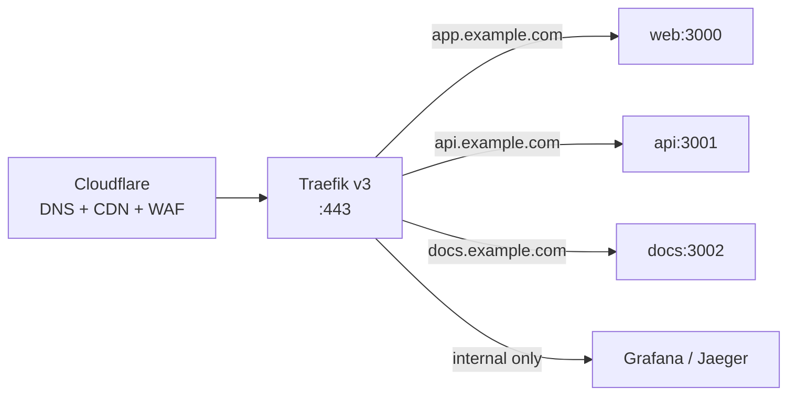
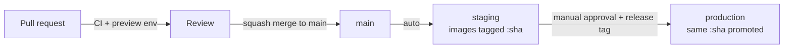

# 11 — Docker, infrastructure & deployment

---

## 1. Docker strategy

### Principles

1. **One image per app**, built once in CI, promoted unchanged through environments.
2. **Multi-stage builds** — build tooling never reaches the runtime image.
3. **Minimal, pruned build context** via `turbo prune`, so a change in `apps/api` does not
   invalidate the `apps/web` build cache.
4. **Non-root, read-only filesystem where possible, no shell in the final stage** unless required.
5. **Reproducible**: pinned base image digests, `--frozen-lockfile`, no `latest`.
6. **Small**: target < 250 MB for the Next image, < 150 MB for `api` and `worker`.
7. **Observable**: `HEALTHCHECK`, graceful `SIGTERM` handling, build metadata as labels.

### Build shape

```dockerfile
# docker/api.Dockerfile — shape, not final code
FROM node:24-alpine AS base
# corepack, pnpm pinned

FROM base AS pruner
COPY . .
RUN pnpm dlx turbo prune @repo/api --docker
# → out/json (manifests only) and out/full (sources)

FROM base AS deps
COPY --from=pruner /app/out/json/ .
RUN --mount=type=cache,id=pnpm,target=/pnpm/store \
    pnpm install --frozen-lockfile

FROM deps AS builder
COPY --from=pruner /app/out/full/ .
RUN pnpm turbo run build --filter=@repo/api
# tsdown bundles to a single JS artifact

FROM node:24-alpine AS runner
RUN addgroup -S nodejs && adduser -S app -G nodejs
COPY --from=builder --chown=app:nodejs /app/apps/api/dist ./dist
USER app
HEALTHCHECK CMD node -e "fetch('http://127.0.0.1:3001/health').then(r=>process.exit(r.ok?0:1))"
CMD ["node", "dist/index.mjs"]
```

Two details that matter more than they look:

**`turbo prune --docker`** splits manifests from sources, so the dependency-install layer is cached
on lockfile changes only. Without it, every source edit reinstalls the whole workspace, and image
builds go from seconds to minutes.

**Backend apps are bundled** (via `tsdown` 0.22, Rolldown-based) rather than shipped as source plus
`node_modules`. This is what makes source-only internal packages
([03](./03-package-graph-and-boundaries.md)) work in production: bundling resolves the workspace
graph at build time, so the runtime image contains the ESM graph and no workspace symlinks. It also
cuts image size dramatically and removes install-time surprises. `sharp` stays external on the
worker image so Alpine can install the musl native binary; the web runner reinstalls `sharp` and
patches traced libvips paths because Next standalone file-tracing often drops the `.so` on musl.
`apps/web` uses Next's `output: "standalone"`, which does the equivalent for the app graph.

**Local prod-like stack** (`docker/compose.prod.yaml`) runs Traefik on HTTP with Docker labels
routing to the built `web` / `api` images; the worker stays internal. GHCR publish and ACME are
Phase 12–13.

### The build/run split for Next.js

`apps/web` bakes `NEXT_PUBLIC_*` values at build time
([09 §5](./09-environment-and-secrets.md#5-build-time-versus-runtime-configuration)). The public
variable set is kept deliberately small so a single image is promotable from staging to production.
`SKIP_ENV_VALIDATION=1` during the build; full validation at container start.

### Local development

`docker/compose.yaml` runs **dependencies only** — Postgres 18, Redis, MinIO, Mailpit, OTel
collector, Jaeger. Applications run on the host via `pnpm dev`.

This is a deliberate choice against running apps in containers locally: HMR through a bind mount is
slow and unreliable on macOS, `node_modules` mounting is fragile, and debugger attachment is
awkward. The consistency argument for containerising development is real but is better served by
pinning tool versions and having a fast `make setup`. Containers are for _dependencies_ (where they
excel) and for _production_ (where they are required).

Volumes are named and persistent; `make db-reset` removes them explicitly.

### Registry and supply chain

Images go to **GitHub Container Registry** (same permissions model as the repo, no extra vendor).

Tagging: `ghcr.io/<owner>/<app>:<git-sha>` always, plus `:v1.2.3` on release and `:staging` /
`:production` as moving pointers to what is deployed. **The SHA tag is what deploys**; the named
tags are for humans, because a mutable tag in a deploy command means you cannot say what is running.

Supply-chain measures: SBOM generated per image, build provenance attestation, Trivy scanning with
a CI failure on HIGH/CRITICAL, and multi-arch (`amd64`/`arm64`) builds so an ARM VPS or an Apple
Silicon laptop is a non-event.

---

## 2. Reverse proxy — Traefik v3

Chosen over nginx and Caddy for one decisive reason: **it discovers services from Docker labels**,
so routing configuration lives beside the service definition and cannot drift from what is actually
running. Automatic ACME certificates, first-class middleware chains, and native metrics complete
the case. nginx needs templating and reloads; Caddy is close but has a smaller middleware ecosystem
and less mature Docker-native discovery.

Responsibilities: TLS termination (Let's Encrypt via DNS-01 through Cloudflare, so wildcard certs
work and no port needs opening for validation), HTTP→HTTPS redirect, routing by host and path,
security headers, rate limiting at the edge, compression, and access logs in JSON.



Middleware chains are defined once and composed per route: `secure-headers`, `rate-limit`,
`compress`, `ip-allowlist` (internal tooling), `basic-auth` (dashboards).

**Cloudflare in front** provides DNS, CDN caching for static assets, WAF rules, DDoS protection, and
bot management. The origin firewall accepts traffic only from Cloudflare IP ranges, so the origin
cannot be reached directly — otherwise the WAF is decorative.

---

## 3. Infrastructure as code — OpenTofu

**OpenTofu over Terraform**: after the HashiCorp licence change, OpenTofu is the Linux
Foundation-governed, MIT-licensed continuation with a compatible provider ecosystem. For a
foundation intended to last years, a permissive licence under neutral governance is the safer bet,
and the migration cost is currently near zero.

```
infra/tofu/
├── modules/
│   ├── server/      # VM, SSH keys, firewall, base cloud-init
│   ├── dns/         # Cloudflare records, proxy settings
│   ├── storage/     # R2 buckets, lifecycle rules, CORS
│   └── network/     # Private network, firewall rules
└── environments/
    ├── staging/     # Composes modules; thin
    └── production/
```

Boundary discipline: **OpenTofu owns resources with a lifecycle** (servers, DNS records, buckets,
firewall rules). **Ansible owns state inside a machine.** Using Tofu to configure servers (via
`remote-exec`) or Ansible to create infrastructure both produce drift that nobody can reconcile.

Practices: remote state in R2 with locking; state is never local. `plan` on every PR touching
`infra/`, posted as a comment; `apply` only from `main` after review. No manual console changes —
drift is detected by a scheduled `plan` that fails when reality diverges. Everything is tagged with
environment and owner.

Providers are chosen so nothing is single-vendor: a VPS provider (Hetzner or DigitalOcean),
Cloudflare, and R2. Moving to another VPS provider means rewriting one module while the Ansible and
Docker layers stay untouched.

---

## 4. Provisioning — Ansible

```
infra/ansible/
├── playbooks/  provision.yml, deploy.yml, backup.yml, rotate-secrets.yml
└── roles/      common, docker, traefik, app, backup, monitoring, hardening
```

`provision.yml` (run rarely): OS updates, unattended-upgrades, users and SSH hardening (key-only,
no root login), firewall (only 22/80/443, and 22 restricted), fail2ban, kernel parameters, Docker
Engine, log rotation, the host `age` key, and the monitoring agent.

`deploy.yml` (run per release): decrypt secrets with SOPS, render the compose file, `docker compose
pull`, run the **migration job to completion**, then roll services one at a time waiting for
healthchecks, then prune old images. It is idempotent and safe to re-run.

Ansible is chosen over shell scripts for idempotency and over Kubernetes because Kubernetes is not
justified at this scale: it adds a control plane to operate, upgrade, and secure, plus manifests,
an ingress controller, and secret management — for orchestration benefits a Compose file on two
machines already provides. The exit path is deliberate, though: the images are standard OCI
artifacts, so moving to Kubernetes later means writing manifests, not changing applications.

---

## 5. Deployment strategy

### Two blessed targets

| Target                           | What runs where                                                                      | When to choose it                                  |
| -------------------------------- | ------------------------------------------------------------------------------------ | -------------------------------------------------- |
| **Self-hosted (primary)**        | All apps on Docker + Traefik on one or more VPS; managed or self-hosted Postgres; R2 | Cost control, data residency, no vendor dependency |
| **Vercel + self-hosted backend** | `apps/web` on Vercel; `api`, `worker`, `tasks` on a VPS                              | Global edge delivery for the UI with minimal ops   |

Both work without code changes because nothing imports `@vercel/*` and nothing depends on
platform-specific primitives. Self-hosted is built and tested first precisely because it is the
strictly harder target — a system that self-hosts cleanly deploys to a platform for free, and the
reverse is not true.

### Environments and promotion



**The same image SHA is promoted.** Production never builds. If staging tested `abc123`, production
runs `abc123`.

### Release sequence

1. Tag a release (`v1.2.3`) from `main`.
2. CI verifies the images for that SHA already exist and passed all gates.
3. **Backups**: confirm a recent database backup and note the PITR timestamp.
4. **Migrate**: run the migration job to completion. Migrations are backward compatible, so old
   code still works if the rollout is aborted here.
5. **Roll** services one at a time; wait for healthy before continuing.
6. **Smoke test**: automated checks against production (health, sign-in, a read, a cheap write).
7. **Watch**: error rate and p95 for 15 minutes, with alerts routed to the deployer.

### Rollback

| Failure point             | Action                                                                                                                               |
| ------------------------- | ------------------------------------------------------------------------------------------------------------------------------------ |
| Migration failed          | It ran in a transaction where possible; fix forward. Destructive migrations require a tested restore plan _before_ they are applied. |
| App unhealthy after roll  | Re-deploy the previous image SHA. Fast, because migrations were backward compatible.                                                 |
| Data corruption           | PITR restore. RTO ≤ 1 hour, drilled monthly.                                                                                         |
| Bad feature behind a flag | Flip the flag. Seconds, no deploy.                                                                                                   |

The reason expand/contract migrations ([06](./06-data-and-storage.md#zero-downtime-expandcontract-as-the-default))
are mandatory is exactly this table: they are what makes "re-deploy the previous SHA" a safe,
boring operation rather than a gamble.

**Feature flags are the primary risk-reduction tool**, not deployment machinery. Deploy dark, flip
on for internal users, then a percentage, then everyone. A rollback that requires a deploy is
minutes; a flag flip is seconds.

### Topology and scaling

Start on **one server** (4 vCPU / 8 GB): Traefik, web, api, worker, Redis, and the OTel collector,
with Postgres managed externally. It is honest about the scale most products actually operate at,
and it is cheap to reason about.

The documented growth path, in order: split `worker` onto its own machine (CPU-bound image work
competing with request serving is the first real bottleneck) → multiple `web`/`api` replicas behind
Traefik → move Redis to a managed instance → add read replicas → introduce a pooler. Each step is
a compose and Ansible change, not an architecture change.

Connection budget is the thing that must be tracked explicitly at every step:
`replicas × DB_POOL_MAX + migrations + admin ≤ server max_connections`. Silent breach of that
inequality is the most common self-hosted outage, so it is a documented number in the runbook, not
a rediscovered fact.

---

## 6. Runbooks

Operational documentation lives in `docs/runbooks/` and is treated as deliverable work, because the
value of a runbook is realised at 3 a.m. by someone who did not write it:

`deploy.md`, `rollback.md`, `restore-database.md`, `rotate-secrets.md`, `scale-up.md`,
`incident-response.md`, `on-call.md`, plus one per alert (`high-error-rate.md`,
`queue-backlog.md`, `db-connections-exhausted.md`, `disk-full.md`).

Each states: symptoms, how to confirm, immediate mitigation, root-cause investigation, and
prevention follow-up. Every alert links to its runbook; an alert without one is either given a
runbook or deleted.
