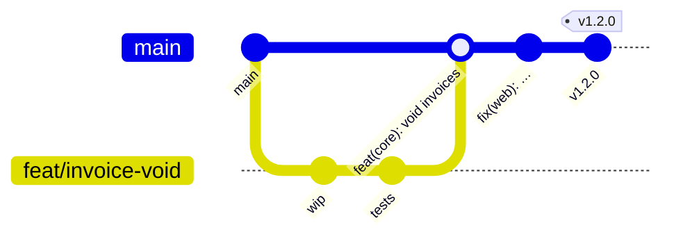
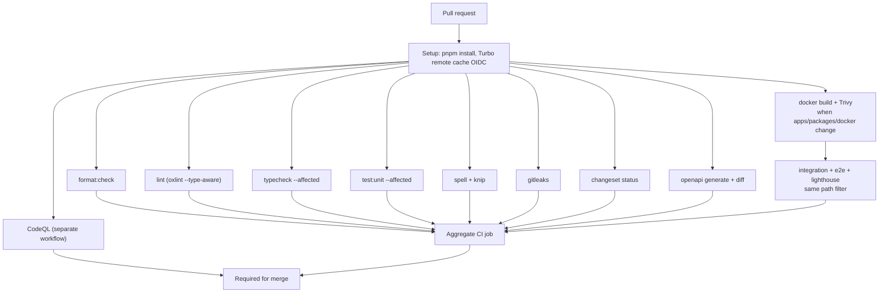
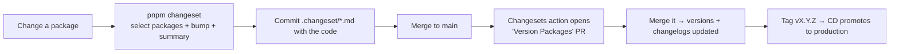

# 12 — Git workflow, CI/CD & release

---

## 1. Git workflow — trunk-based

**One long-lived branch (`main`), short-lived feature branches, squash merges, linear history.**



Rules:

1. **`main` is always releasable.** It is protected: no direct pushes, no force pushes.
2. **Branches live hours to days**, not weeks. A branch open for two weeks is a merge conflict
   generator and an integration risk.
3. **Squash merge only.** One PR becomes one commit, so `main`'s history is a readable list of
   changes and `git bisect` is meaningful. Work-in-progress commits stay on the branch.
4. **Linear history.** No merge commits on `main`.
5. **Unfinished work ships behind a flag**, never on a branch. This is the whole reason
   feature flags exist ([08 §4](./08-observability.md#4-feature-flags)) and why we do not need
   Git Flow's `develop` branch.

### Why not Git Flow or long-lived release branches

Git Flow was designed for versioned software shipped to customers who install it. We deploy a
service continuously. `develop`, `release/*`, and `hotfix/*` branches add ceremony and a permanent
integration debt. A hotfix here is simply a small PR to `main` promoted immediately — the same path
as everything else, which is what makes it reliable under pressure.

Long-lived release branches are only warranted if we must support multiple concurrent versions in
the field. If a customer ever requires that, it gets its own ADR.

### Branch protection on `main`

Required: PR with one approval, `CODEOWNERS` review for protected paths, all status checks green,
branch up to date, conversations resolved, linear history, signed commits, no force push, no
deletion. Administrators are included — an exception that exists is an exception that gets used.

`CODEOWNERS` assigns stricter review to the paths where mistakes are expensive:
`packages/db/src/migrations/`, `packages/authz/`, `packages/auth/`, `.github/workflows/`,
`docker/`, `docs/runbooks/`, and `docs/adr/`.

---

## 2. Git hooks — Lefthook

**Lefthook over Husky**: a single Go binary, no Node process spawn per hook, parallel execution, and
a declarative YAML config. Husky's shell scripts plus `lint-staged` are slower and more fragile.

```yaml
# lefthook.yml — shape
pre-commit:
  parallel: true
  commands:
    format: { glob: "*.{ts,tsx,js,json,css,md}", run: "oxfmt {staged_files}", stage_fixed: true }
    lint: { glob: "*.{ts,tsx}", run: "oxlint {staged_files}" }
    secrets: { run: "gitleaks protect --staged --redact" }

commit-msg:
  commands:
    commitlint: { run: "pnpm commitlint --edit {1}" }

pre-push:
  parallel: true
  commands:
    typecheck: { run: "pnpm turbo run typecheck --affected" }
    test: { run: "pnpm turbo run test:unit --affected" }
```

**Hooks are fast on purpose.** Pre-commit is sub-second; pre-push is seconds. Integration and E2E
tests are never in hooks. This is a deliberate trade: a slow hook gets bypassed with `--no-verify`,
and a bypassed hook protects nothing. CI is the real gate; hooks exist to avoid burning a CI cycle
on a formatting mistake.

Secret scanning is the exception to "hooks catch trivia" — it is in pre-commit because a committed
secret is compromised the instant it is pushed, so catching it in CI is already too late.

---

## 3. Continuous integration

Fast, parallel, and reproducible locally via `make check`.



Practices that keep it honest:

- **Concurrency group per branch** with cancel-in-progress, so a new push does not queue behind a
  stale run.
- **`--affected`** limits typecheck and unit tests to packages the diff touches on PRs and
  merge-group runs; **`main` always runs the full set**.
- **Path filters** skip image, E2E, Lighthouse, and integration jobs when the diff cannot affect
  apps, packages, Dockerfiles, or the lockfile (again: full set on `main`).
- **Turborepo remote cache** via Vercel OIDC (`vercel/setup-turborepo-remote-cache-action`) when the
  repository variable `TURBO_TEAM` is set. One-time setup: create a Turborepo CLI OIDC policy on the
  Vercel team for this repo, then `gh variable set TURBO_TEAM --body "<team-slug>"`. Jobs need
  `id-token: write`. Forks and unset repos fall back to the Actions `.turbo` cache only.
- The `env` field in `turbo.json` must list every variable that affects output (including
  `NEXT_PUBLIC_*` and `SKIP_ENV_VALIDATION` on `build`), or the cache will serve a wrong artifact —
  this is the one place remote caching can cause a genuinely confusing production bug, so it is
  reviewed carefully.
- **Pinned action SHAs**, not tags. A mutable tag in a workflow with repository permissions is a
  supply-chain hole.
- **Minimal `permissions:`** per job, `id-token: write` where OIDC is needed (remote cache, image
  attestations).
- **No secrets in PR workflows from forks.** Jobs needing secrets run only on branches in the repo.
- **Every job uploads artifacts on failure**: Playwright traces, test reports, build logs. A red CI
  run with no artifact costs someone an hour.
- **CodeQL** runs as its own required workflow so its duration does not dominate the aggregate CI
  wall-clock.
- **Trivy** fails the images job (and the publish workflow) on HIGH/CRITICAL findings.

Duration target: **under 6 minutes** for a typical PR. CI slower than a coffee break changes how
people work — they batch changes into bigger PRs, which is worse for everything.

---

## 4. Continuous deployment

| Trigger             | Action                                                                                                    |
| ------------------- | --------------------------------------------------------------------------------------------------------- |
| PR opened/updated   | CI (+ CodeQL)                                                                                             |
| PR merged to `main` | Publish multi-arch images to GHCR as `:sha` with SBOM + provenance (`publish.yml`); Changesets version PR |
| Release tag `v*`    | Retag the same `:sha` images to `:vX.Y.Z` (`retag-images.yml`)                                            |
| Manual dispatch     | Re-run publish for an arbitrary SHA (break-glass)                                                         |

Phase 12 stops at immutable registry artifacts (`web`, `api`, `worker`, `migrate`). Deploying those
SHA tags to a host is **bring-your-own CD** — see [docs/runbooks/deploy.md](../runbooks/deploy.md)
and Phase 13 (deployability) in [14](./14-implementation-plan.md).

**CI is the only thing that builds release artifacts.** No local `docker push`; registry write
permission belongs to the workflow identity only. Otherwise the provenance chain — this image came
from this commit, which passed these checks — is broken, and it is exactly what you need during an
incident.

Image coordinates: `ghcr.io/<owner>/{web,api,worker,migrate}:<git-sha>`. Owner is lowercased. Local
`make images` / `make prod-up` still use `repo-*:local` tags.

---

## 5. Versioning and releases — Changesets

### What is versioned, and what is not

| Thing                     | Versioned how                                                                                                    |
| ------------------------- | ---------------------------------------------------------------------------------------------------------------- |
| `packages/*`              | Changesets: semver, changelog per package                                                                        |
| `apps/*`                  | Not versioned as packages (`"private": true`, listed in Changesets' `ignore`). Released as git tags + image tags |
| The repository as a whole | Git tag `vX.Y.Z`, whose changelog aggregates the package changesets in that release                              |

Internal packages are never published to a registry — nothing outside this repo consumes them.
Changesets is used for **changelogs and coordinated version bumps**, which is where its value is
here: a reviewable, human-written record of what changed and why, per package.

### Why Changesets rather than semantic-release

`semantic-release` derives versions from commit messages, which sounds elegant and works poorly in
a monorepo: commit messages are written for reviewers, not release notes, and mapping commits to the
right package is guesswork. Changesets makes the intent explicit — the author declares which
packages changed and at what severity, in a file that is reviewed alongside the code. Commit
messages stay useful for history (Conventional Commits, enforced) and changesets carry release
intent. Two mechanisms, two purposes, neither overloaded.

### Flow



CI fails a PR that changes a package's public surface without a changeset (`changeset status
--since=origin/main`). Changes confined to apps, tests, docs, or config need none.

The Release workflow opens the Version Packages PR with `GITHUB_TOKEN`. Repository setting
**Actions → General → Workflow permissions → Allow GitHub Actions to create and approve pull
requests** must be enabled, or the push of `changeset-release/main` succeeds and the PR create
step fails.

### Semver applied to internal packages

Even unpublished, the bump level communicates intent to reviewers and to future readers of the
changelog:

- **Major** — a breaking change to a package's exported surface, a database migration requiring
  coordination, or a removed error code.
- **Minor** — new functionality, backward compatible.
- **Patch** — fixes, performance, internal refactors.

`0.x` is avoided: pre-1.0 semver invites treating every change as acceptable, which defeats the
signal the version is supposed to carry.

---

## 6. Dependency updates — Renovate

Renovate over Dependabot: monorepo-aware, groups related packages, understands pnpm catalogs,
supports Dockerfiles, GitHub Actions, and OpenTofu providers in one tool, and its scheduling and
auto-merge rules are far more expressive.

Configuration intent:

| Group                                                          | Schedule                                                              | Auto-merge             |
| -------------------------------------------------------------- | --------------------------------------------------------------------- | ---------------------- |
| Dev-dependency patch/minor (linters, formatters, test tooling) | Weekly, Monday morning                                                | Yes, if CI passes      |
| Production-dependency patch                                    | Weekly                                                                | Yes, if CI passes      |
| Production-dependency minor                                    | Weekly, grouped by ecosystem (React, TanStack, OTel, Drizzle, Sentry) | No — review            |
| Major                                                          | Monthly, one PR per package, with the release notes in the body       | No — often an ADR      |
| Security advisories                                            | Immediately, any day                                                  | Yes for patches        |
| `@types/*`                                                     | Grouped with their runtime package                                    | Yes                    |
| Docker base images                                             | Weekly (digest pinning)                                               | Yes after Trivy passes |
| GitHub Actions                                                 | Monthly, SHA-pinned                                                   | No                     |

Guardrails: concurrent PR limit (5) so review does not drown; a **minimum release age of 3 days**
for non-security updates, which cheaply avoids the compromised-package and instantly-yanked-release
windows; a lockfile-maintenance PR weekly; grouped monorepo releases (all `@opentelemetry/*`
together) because splitting them produces broken intermediate states.

Ecosystem-specific pins requiring manual review: `next` + `react` majors, `typescript` (the
toolchain tracks it — see the risk register in [13](./13-dependency-review.md)), `drizzle-orm`,
`better-auth`, and `oxlint-tsgolint` (which is versioned against a specific TypeScript release, so
it must move in lockstep with `typescript`).

---

## 7. Pull requests

### Template requirements

**What** changed, **why** (linked issue), **how it was verified**, screenshots for UI changes, and
explicit checkboxes for: tests added, docs updated, changeset added if a package surface changed,
migration reviewed for backward compatibility, and no new dependency without justification.

### Review expectations

- **Small PRs.** Under ~400 changed lines where possible; review quality falls off a cliff beyond
  that, and large PRs get rubber-stamped.
- **The author runs `make check` before requesting review.** CI is a safety net, not a first
  attempt.
- Reviewers check architecture and boundary adherence, security implications (authorization,
  tenant scoping, input validation), test quality rather than presence, and naming.
- Formatting and style are never discussed — Oxfmt decides, and there is nothing to debate.
- Non-blocking suggestions are prefixed `nit:` so blocking and advisory feedback are
  distinguishable.

### Issue templates

Bug report (with environment, reproduction, expected vs actual, request id), feature request (with
problem statement before proposed solution), technical debt (with impact and proposed remedy), and
a link to Discussions for open-ended questions. Templates exist to make the reporter supply the
information the responder will otherwise have to ask for.

---

## 8. AI agent configuration

Machine-readable architecture rules in `.cursor/rules/*.mdc` and `AGENTS.md`, kept in sync with
this document. They encode: layer boundaries and which imports are legal from where, the canonical
service shape, naming conventions, the "no business logic in transports" rule, the requirement that
services take an actor and authorize first, and the tenant-scoping requirement.

This is genuine architecture work in 2026, not a novelty. Agents generate a large share of code,
and an agent that does not know the boundaries will produce code that compiles, passes review at a
glance, and quietly violates the layering — for example putting a Drizzle query in a tRPC resolver.
The rules are versioned with the architecture they describe, and they are updated in the same PR
whenever a convention changes.
