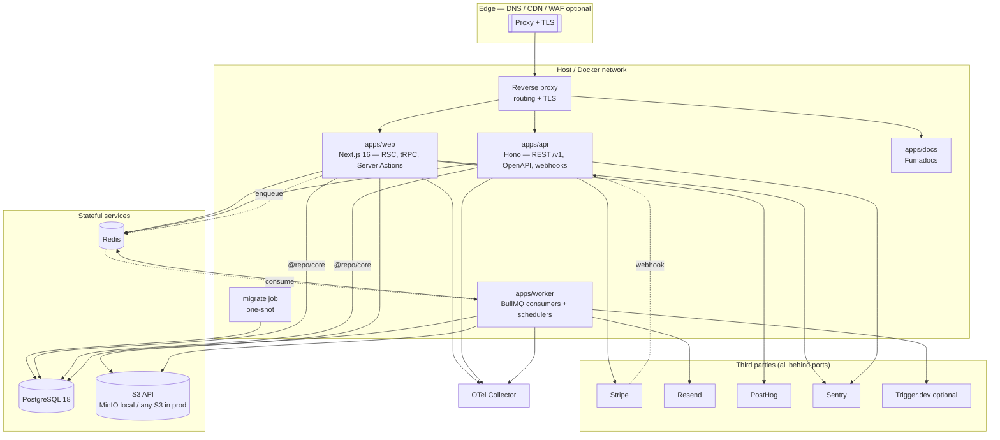

# Architecture

This is the architecture document for the boilerplate. It is written to be read **before**
any code exists, and to remain the reference document for years after.

Status: **accepted — validated 2026-07-30**
Date: 2026-07-30
Authors: platform engineering

---

## 1. What this repository is

A **production-grade, self-hostable, cloud-agnostic application foundation**: a Turborepo
monorepo containing a Next.js product application, a public REST API, background workers, a
documentation site, and the shared packages that hold all business logic and infrastructure
adapters.

It is not a demo. Every file in it is meant to be copied into real products and maintained for
years. The design bias is therefore always: **maintainability > scalability > developer
experience > time-to-first-commit.**

### Non-goals

Being explicit about non-goals is what keeps a boilerplate from rotting into a framework.

| Non-goal                                       | Why                                                                                                                                          |
| ---------------------------------------------- | -------------------------------------------------------------------------------------------------------------------------------------------- |
| Supporting multiple databases                  | One well-understood database (PostgreSQL) beats an abstraction over three. Portability comes from SQL and Drizzle, not from a dialect layer. |
| Supporting multiple deployment targets equally | Two are supported and tested: self-hosted Docker and Vercel. Others are possible but unblessed.                                              |
| A generic plugin system                        | Products fork this repo; they do not extend it via plugins. Convention replaces configuration.                                               |
| Runtime-agnostic code (Deno/Bun/Workers)       | Node.js LTS only. Edge-compatible code is an explicit, narrow subset (see §Runtime boundaries).                                              |
| 100 % test coverage                            | Coverage is a diagnostic, not a target. See [Testing](./10-testing.md).                                                                      |
| An admin UI, CMS, or billing UI out of the box | Those are product decisions. The foundation ships the primitives (RBAC, Stripe adapter, storage) and no product surface beyond auth.         |

---

## 2. Reading order

| #   | Document                                                                     | What it answers                                                        |
| --- | ---------------------------------------------------------------------------- | ---------------------------------------------------------------------- |
| 01  | [Principles & constraints](./01-principles-and-constraints.md)               | The rules every later decision is derived from                         |
| 02  | [Repository topology](./02-repository-topology.md)                           | Folder structure, what each app and package is for                     |
| 03  | [Package graph & boundaries](./03-package-graph-and-boundaries.md)           | Layering, allowed dependencies, how boundaries are enforced            |
| 04  | [Conventions](./04-conventions.md)                                           | Naming, file layout, coding style, module conventions                  |
| 05  | [Runtime architecture & API strategy](./05-runtime-and-api.md)               | Clean architecture in practice; tRPC vs REST; one core, two transports |
| 06  | [Data, persistence & storage](./06-data-and-storage.md)                      | PostgreSQL, Drizzle, migrations, multi-tenancy, S3, caching            |
| 07  | [Authentication & authorization](./07-auth.md)                               | Better Auth, sessions, API keys, RBAC + record-level policies          |
| 08  | [Observability](./08-observability.md)                                       | Error handling, logging, tracing, analytics, feature flags             |
| 09  | [Environment, config & secrets](./09-environment-and-secrets.md)             | Env validation, runtime catalog, secrets patterns for adopters         |
| 10  | [Testing](./10-testing.md)                                                   | What we test, at which level, and what we refuse to test               |
| 11  | [Docker, infrastructure & deployment](./11-infrastructure-and-deployment.md) | Images, local Traefik, BYO infra, migrate-then-roll                    |
| 12  | [Git, CI/CD & release](./12-git-ci-release.md)                               | Branching, hooks, pipelines, Changesets, versioning                    |
| 13  | [Dependency review](./13-dependency-review.md)                               | Every dependency justified, every alternative rejected, risks tracked  |
| 14  | [Implementation plan](./14-implementation-plan.md)                           | The phased, reviewable build order                                     |
| —   | [ADRs](../adr/README.md)                                                     | The decision log                                                       |

---

## 3. The five decisions that define this architecture

Everything else is detail. These five are the load-bearing walls.

### 3.1 One core, two transports

Business logic lives in **`packages/core`**, organised by feature, and knows nothing about
HTTP, tRPC, React, or Next.js. `apps/web` (tRPC + Server Actions) and `apps/api` (public
REST/OpenAPI) are _transports_ that validate input, resolve an actor, call a core service, and
map errors to their wire format.

This is the single most valuable property of the repo. It is what makes "private API with tRPC"
and "public API with REST + OpenAPI" a non-duplicated requirement instead of two codebases
that drift. See [05](./05-runtime-and-api.md).

### 3.2 Layered packages, enforced by the package manager

Packages are assigned to numbered layers and may only depend downward. This is not enforced by
a linter plugin that people disable — it is enforced by `package.json` declarations plus pnpm's
isolated `node_modules`, which makes an undeclared import **physically unresolvable**. See
[03](./03-package-graph-and-boundaries.md).

### 3.3 Deny-by-default authorization inside the domain, never at the edge

`proxy.ts` (Next 16's replacement for `middleware.ts`) does routing and cookie presence checks
only. Real authorization happens in core services, which take an explicit `actor` and consult a
policy. RBAC covers coarse capabilities; policy functions cover record-level rules such as
ownership. Nothing is authorized by virtue of which route it was reached from. See
[07](./07-auth.md).

### 3.4 The same artifact runs everywhere

One set of container images built once in CI, promoted through environments by tag. No
environment-specific builds, no `NODE_ENV`-conditioned business logic, no cloud-provider SDKs
in application code — S3 API rather than R2 SDK, OTLP rather than a vendor agent, standard
PostgreSQL over TCP rather than a proprietary serverless driver. Self-hosting is the default
path and Vercel is a supported convenience, not a dependency. See
[11](./11-infrastructure-and-deployment.md).

### 3.5 Toolchain on the native (Rust/Go) tier

TypeScript 7, Oxlint (with type-aware linting via tsgolint), and Oxfmt replace tsc-on-Node,
ESLint, and Prettier. This is not novelty-chasing; as of July 2026 it is the _only_ coherent
choice, and the reasoning is important enough to state here rather than bury in the dependency
review:

- TypeScript 7.0 went GA on 2026-07-08 as a native Go port, ~10× faster, with type-checking
  semantics ported rather than rewritten.
- TypeScript 7.0 ships **without a stable programmatic compiler API** (expected in 7.1, ~Q4
  2026). Consequently **typescript-eslint closed its TS 7 support request as "not planned"**,
  and ESLint core is blocked behind it.
- Oxlint does not embed the TypeScript compiler for syntax rules, and its type-aware backend
  (`oxlint-tsgolint`) is built directly on `typescript-go`. Type-aware linting went **stable on
  2026-07-22** with 59 of typescript-eslint's 61 type-aware rules.

So the ESLint path means either staying on TypeScript 6 or losing type-aware lint rules. The
Oxc path gets both. `@typescript/typescript6` (which installs a `tsc6` binary) is kept available
as an escape hatch for any tool that still needs the old API. See
[13](./13-dependency-review.md) for the risk register on this.

---

## 4. Stack matrix

Versions verified against the npm registry on **2026-07-30**. These are the versions the
implementation will pin; they are recorded here so that future readers can tell what was
current when the decisions were made.

### Foundation

| Concern             | Choice                      | Version |
| ------------------- | --------------------------- | ------- |
| Runtime             | Node.js LTS                 | 24.x    |
| Package manager     | pnpm (via Corepack)         | 11.17.0 |
| Monorepo            | Turborepo                   | 2.10.7  |
| Language            | TypeScript (strict, native) | 7.0.2   |
| Compat escape hatch | `@typescript/typescript6`   | 6.0.2   |

### Application

| Concern           | Choice                        | Version |
| ----------------- | ----------------------------- | ------- |
| Framework         | Next.js (App Router)          | 16.2.12 |
| UI runtime        | React                         | 19.2.8  |
| Styling           | Tailwind CSS                  | 4.3.3   |
| Component recipes | shadcn/ui (CLI, Base UI mode) | 4.16.0  |
| UI primitives     | `@base-ui/react`              | 1.6.0   |
| Icons             | `@hugeicons/react`            | 1.1.9   |
| Animation         | Motion                        | 12.43.0 |
| Forms             | React Hook Form               | 7.83.0  |
| Validation        | Zod                           | 4.4.3   |
| Server state      | TanStack Query                | 5.101.4 |
| Client state      | Zustand                       | 5.0.14  |
| Tables            | TanStack Table                | 8.21.3  |
| Rich text         | Tiptap                        | 3.29.2  |
| Charts            | Recharts                      | 3.10.1  |
| Theming           | next-themes                   | 0.4.6   |
| i18n              | next-intl                     | 4.13.4  |
| Toasts            | Sonner                        | 2.0.7   |
| Dates             | date-fns                      | 4.4.0   |
| URL state         | nuqs                          | 2.9.3   |

> **Note on Base UI:** the package was renamed. The old `@base-ui-components/react` stopped at
> `1.0.0-rc.0`; the maintained package is **`@base-ui/react`, now at 1.6.0**. shadcn/ui made
> Base UI its **default** primitive base in July 2026 (Radix remains supported via
> `shadcn init -b radix`). We initialise on Base UI, which means our shadcn components are on
> the path the upstream project actively develops.

### Backend

| Concern           | Choice                     | Version                       |
| ----------------- | -------------------------- | ----------------------------- |
| Private API       | tRPC                       | 11.18.0                       |
| Public API        | Hono + `@hono/zod-openapi` | 4.12.32 / 1.5.1               |
| API reference UI  | Scalar                     | 0.11.11                       |
| Auth              | Better Auth                | 1.6.25                        |
| Database          | PostgreSQL                 | 18.x                          |
| ORM               | Drizzle ORM                | 0.45.2 (see open question Q1) |
| Migrations        | drizzle-kit                | 0.31.10                       |
| Schema bridge     | drizzle-zod                | 0.8.3                         |
| Cache             | Redis (via ioredis)        | 5.11.1                        |
| Queues            | BullMQ                     | 5.81.2                        |
| Durable workflows | Trigger.dev                | 4.5.8 (optional)              |
| Object storage    | S3 API (R2 / MinIO)        | —                             |
| Images            | Sharp                      | 0.35.3                        |
| Email delivery    | Resend                     | 6.18.1                        |
| Email templates   | React Email                | 1.0.12                        |
| Payments          | Stripe                     | 22.3.2                        |

### Observability

| Concern           | Choice            | Version |
| ----------------- | ----------------- | ------- |
| Traces/metrics    | OpenTelemetry SDK | 0.221.0 |
| Logging           | Pino              | 10.3.1  |
| Errors            | Sentry            | 10.69.0 |
| Product analytics | PostHog           | 1.408.0 |

### Quality & testing

| Concern          | Choice                            | Version      |
| ---------------- | --------------------------------- | ------------ |
| Lint             | Oxlint                            | 1.76.0       |
| Type-aware lint  | `oxlint-tsgolint`                 | 7.0.2001     |
| Format           | Oxfmt                             | 0.61.0       |
| Unused code/deps | Knip                              | 6.29.0       |
| Spelling         | CSpell                            | 10.0.1       |
| Git hooks        | Lefthook                          | 2.1.10       |
| Commit lint      | commitlint                        | 21.2.1       |
| Versioning       | Changesets                        | 2.31.1       |
| Unit/integration | Vitest                            | 4.1.10       |
| E2E              | Playwright                        | 1.62.0       |
| Network mocking  | MSW                               | 2.15.0       |
| Accessibility    | axe-core + `@axe-core/playwright` | 4.12.1       |
| Load testing     | k6                                | 1.x (binary) |
| Docs site        | Fumadocs                          | 16.13.0      |

### Runtime & deployability

| Concern                | Choice in this repo                                                                                 |
| ---------------------- | --------------------------------------------------------------------------------------------------- |
| Containers             | Docker + Compose                                                                                    |
| Local reverse proxy    | Traefik v3 in `compose.prod` (example only)                                                         |
| Registry               | GitHub Container Registry (`:sha` images)                                                           |
| Migrations             | One-shot `migrate` image; never on app boot                                                         |
| Host / DNS / TLS / IaC | Bring-your-own — see [11 §3](./11-infrastructure-and-deployment.md#3-bring-your-own-infrastructure) |
| Object storage API     | S3-compatible (R2, MinIO, …)                                                                        |
| Postgres               | PostgreSQL 18 (any host; Neon is one option)                                                        |

---

## 5. High-level system view

The important property of this diagram: **`apps/web`, `apps/api`, and `apps/worker` all reach
the database through the same `@repo/core` services.** They are three deployment shapes over
one domain, not three services with three copies of the rules.

---

## 6. Decision summary

Full reasoning lives in the linked documents and in the [ADRs](../adr/README.md). This table is
the executive summary.

| Area                 | Decision                                                                           | One-line rationale                                                                                    |
| -------------------- | ---------------------------------------------------------------------------------- | ----------------------------------------------------------------------------------------------------- |
| Monorepo tool        | Turborepo                                                                          | Task graph + remote cache with near-zero config; Nx's generators/plugins are a lock-in we do not need |
| Internal packages    | Ship TypeScript source, no per-package build                                       | Removes N build steps; Next transpiles workspace packages, backend apps are bundled once              |
| Layering             | Numbered layers, downward-only deps                                                | Cheap to explain, impossible to violate accidentally under pnpm                                       |
| Business logic       | `packages/core`, feature modules                                                   | One implementation behind both transports                                                             |
| Dependency inversion | Ports only for side effects (email, storage, payments, jobs, clock)                | Inverting the ORM is a well-known anti-pattern; Drizzle _is_ the data layer                           |
| Private API          | tRPC 11                                                                            | End-to-end types for a first-party client, no codegen step                                            |
| Public API           | Hono + zod-openapi                                                                 | Spec generated from the same Zod schemas, so docs cannot drift                                        |
| Errors               | Typed `AppError` hierarchy with stable codes, thrown in core, mapped at transports | Stable machine-readable contract, RFC 9457 on REST, no leaking internals                              |
| Result types         | Rejected (`neverthrow`)                                                            | Viral generics across every layer for a benefit exceptions already give us at the boundary            |
| Auth                 | Better Auth, DB sessions + cookie cache                                            | Self-hostable, owns its tables, first-class Drizzle + org/RBAC plugins                                |
| Authorization        | Better Auth AC for RBAC + our own policy functions for record-level                | RBAC alone cannot express "own resource"                                                              |
| Database             | PostgreSQL 18, single schema, UUIDv7 keys                                          | Time-sortable keys, boring and portable schema                                                        |
| Migrations           | drizzle-kit generate → reviewed SQL → applied by a CD job                          | Never on app boot, never `push` outside local                                                         |
| Multi-tenancy        | Shared schema + `organization_id` + scoped query helpers, RLS as optional defence  | Simplest model that scales; RLS interacts badly with poolers                                          |
| Jobs                 | BullMQ for throughput, Trigger.dev for durable workflows, shared payload contracts | Split by workload class, not by a leaky abstraction                                                   |
| Storage              | S3 API only, presigned direct uploads                                              | R2 in prod and MinIO locally with identical code                                                      |
| Config               | Hand-rolled Zod env module                                                         | ~80 lines beats a dependency; we need custom composition anyway                                       |
| Secrets              | Injected at deploy; SOPS + age is one adopter pattern                              | Boilerplate stays host-agnostic; no encrypted secret tree required                                    |
| Deploy               | SHA-tagged OCI images + migrate-then-roll                                          | Same artifact everywhere; orchestration is bring-your-own                                             |
| Observability        | OTLP to a collector we own; Sentry for errors                                      | Backend-swappable, no vendor agent in app code                                                        |
| Feature flags        | Own `@repo/flags` interface, env provider by default, PostHog provider optional    | Works offline and self-hosted; flags are not a hard dependency                                        |
| Lint/format          | Oxlint + tsgolint + Oxfmt                                                          | The only path that keeps type-aware linting on TypeScript 7                                           |
| Tests                | Vitest + Testing Library + Playwright, real Postgres for repository tests          | Mocked databases test the mock                                                                        |
| Releases             | Changesets for packages, git tags + image tags for apps                            | Apps are deployed, not published                                                                      |
| Git                  | Trunk-based, short-lived branches, squash merge, linear history                    | Long-lived branches are a worse version of feature flags                                              |

---

## 7. Validated decisions

Five forks depended on intent rather than engineering merit. All were decided on **2026-07-30**;
each recommendation was accepted.

**Q1 — Drizzle version: `0.45.2` stable.** ✅
`1.0.0-rc.4` would have made the v3 migration-folder conversion free, but an RC pinned into a
foundation repository is the kind of thing that gets forgotten at exactly the wrong moment, and
"production-ready by default" is a stated principle here. The v1 upgrade is **tracked, scheduled
work** with a defined trigger (v1 GA), recorded in
[ADR-0008](../adr/0008-drizzle-version-selection.md) and risk register R4. If v1 reaches GA before
Phase 3 begins, we adopt it from the start instead.

**Q2 — Trigger.dev: scaffolded, disabled by default.** ✅
`apps/tasks` exists with `TRIGGER_ENABLED=false`, so the repository boots, tests, and deploys with
no `@trigger.dev/*` dependency. BullMQ covers the common cases; the two are split by workload
class ([06 §6](./06-data-and-storage.md#6-jobs),
[ADR-0007](../adr/0007-split-background-work-bullmq-triggerdev.md)).

**Q3 — Multi-tenancy: organization-scoped from day one.** ✅
`organization_id` on every tenant-scoped table, isolation enforced primarily by the `TenantCtx`
type so a missing tenant filter is a compile error. Single-user products get an automatically
created personal organization, so the model is present but invisible in the UI
([ADR-0006](../adr/0006-organization-scoped-multi-tenancy.md)).

**Q4 — Primary deployment target: self-hosted Docker + Traefik.** ✅
Built and tested first because it is the strictly harder target; Vercel for `apps/web` then works
without special-casing ([11 §5](./11-infrastructure-and-deployment.md#5-deployment-strategy)).

**Q5 — Product surface: auth + organizations + settings, plus one worked vertical slice.** ✅
The slice exercises every layer (tRPC + REST + policy + job + storage + both test levels) and
becomes the reference implementation every future feature is copied from. Stripe billing is
deferred to Phase 17.

---

## 8. How to change this document

The architecture document describes the _current_ intended design. When a decision changes:

1. Write an ADR in [`docs/adr/`](../adr/README.md) recording the change, its context, and what
   it supersedes. ADRs are append-only; superseded ones are marked, never deleted.
2. Update the affected architecture document so it always reflects the present.
3. Reference the ADR from the changed section.

Architecture documents drift into fiction when they double as history. The ADR log is the
history; these documents are the present tense.
