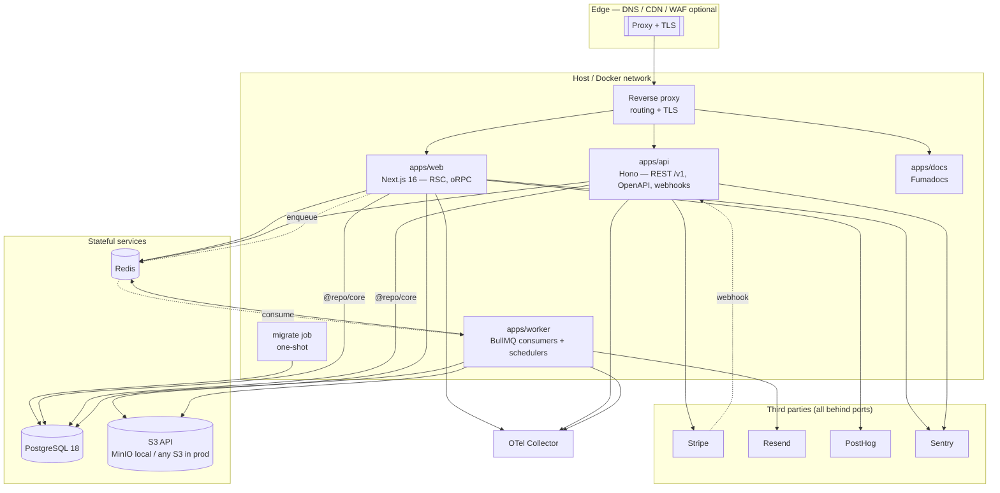

# Architecture

This is the architecture document for the boilerplate. It describes the **system as it is**: a
working monorepo, not a design to be built. When a decision changes, write an ADR and update the
affected document in the same change — these pages are present tense; the [ADR log](../adr/README.md)
is the history.

Status: **accepted and implemented**
Last reviewed: 2026-09-06
Authors: platform engineering

---

## 1. What this repository is

A **production-grade, self-hostable, cloud-agnostic application foundation**: a Turborepo
monorepo containing a Next.js product application, a public REST API, background workers, a
documentation site, and the shared packages that hold all business logic and infrastructure
adapters.

It is not a demo. Every file in it is meant to be copied into real products and maintained for
years. The design bias is therefore always: **maintainability > scalability > developer
experience > time-to-first-commit.**

The foundation ships auth, organizations, settings, a billing invoice vertical slice, and Stripe
SaaS billing as **reference implementations** — patterns to copy, not a product roadmap.

### Non-goals

Being explicit about non-goals is what keeps a boilerplate from rotting into a framework.

| Non-goal                                       | Why                                                                                                                                          |
| ---------------------------------------------- | -------------------------------------------------------------------------------------------------------------------------------------------- |
| Supporting multiple databases                  | One well-understood database (PostgreSQL) beats an abstraction over three. Portability comes from SQL and Drizzle, not from a dialect layer. |
| Supporting multiple deployment targets equally | Two are supported and tested: self-hosted Docker and Vercel. Others are possible but unblessed.                                              |
| A generic plugin system                        | Products fork this repo; they do not extend it via plugins. Convention replaces configuration.                                               |
| Runtime-agnostic code (Deno/Bun/Workers)       | Node.js LTS only. Edge-compatible code is an explicit, narrow subset (see [01](./01-principles-and-constraints.md#3-runtime-boundaries)).    |
| 100 % test coverage                            | Coverage is a diagnostic, not a target. See [Testing](./10-testing.md).                                                                      |
| A generic admin UI or CMS                      | Those are product decisions.                                                                                                                 |

---

## 2. Reading order

| #   | Document                                                                     | What it answers                                                        |
| --- | ---------------------------------------------------------------------------- | ---------------------------------------------------------------------- |
| 01  | [Principles & constraints](./01-principles-and-constraints.md)               | The rules every later decision is derived from                         |
| 02  | [Repository topology](./02-repository-topology.md)                           | Folder structure, what each app and package is for                     |
| 03  | [Package graph & boundaries](./03-package-graph-and-boundaries.md)           | Layering, allowed dependencies, how boundaries are enforced            |
| 04  | [Conventions](./04-conventions.md)                                           | Naming, file layout, coding style, module conventions                  |
| 05  | [Runtime architecture & API strategy](./05-runtime-and-api.md)               | Clean architecture in practice; oRPC vs REST; one core, two transports |
| 06  | [Data, persistence & storage](./06-data-and-storage.md)                      | PostgreSQL, Drizzle, migrations, multi-tenancy, S3, caching            |
| 07  | [Authentication & authorization](./07-auth.md)                               | Better Auth, sessions, API keys, RBAC + record-level policies          |
| 08  | [Observability](./08-observability.md)                                       | Error handling, logging, tracing, analytics, feature flags             |
| 09  | [Environment, config & secrets](./09-environment-and-secrets.md)             | Env validation, runtime catalog, secrets patterns for adopters         |
| 10  | [Testing](./10-testing.md)                                                   | What we test, at which level, and what we refuse to test               |
| 11  | [Docker, infrastructure & deployment](./11-infrastructure-and-deployment.md) | Images, local Traefik, BYO infra, migrate-then-roll                    |
| 12  | [Git, CI/CD & release](./12-git-ci-release.md)                               | Branching, hooks, pipelines, Changesets, versioning                    |
| 13  | [Dependency review](./13-dependency-review.md)                               | Every dependency justified, every alternative rejected, risks tracked  |
| 14  | [Build history](./14-build-history.md)                                       | How the foundation was sequenced — complete, not a backlog             |
| —   | [ADRs](../adr/README.md)                                                     | The decision log                                                       |
| —   | [Security](../security/security-review.md)                                   | Authorization matrix, review checklist, accessibility audit            |
| —   | [Runbooks](../runbooks/deploy.md)                                            | Deploy, incidents, backup, restore                                     |

---

## 3. The five decisions that define this architecture

Everything else is detail. These five are the load-bearing walls.

### 3.1 One core, two transports

Business logic lives in **`packages/core`**, organised by feature, and knows nothing about
HTTP, oRPC, React, or Next.js. `apps/web` (oRPC) and `apps/api` (public REST/OpenAPI) are
_transports_ that validate input, resolve an actor, call a core service, and map errors to their
wire format. Job consumers in `apps/worker` are a third transport over the same services.

This is the single most valuable property of the repo. It is what makes "private API with oRPC"
and "public API with REST + OpenAPI" a non-duplicated requirement instead of two codebases
that drift. See [05](./05-runtime-and-api.md) and
[ADR-0003](../adr/0003-one-domain-core-two-transports.md).

### 3.2 Layered packages, enforced by the package manager

Packages are assigned to numbered layers and may only depend downward. This is not enforced by
a linter plugin that people disable — it is enforced by `package.json` declarations plus pnpm's
isolated `node_modules`, which makes an undeclared import **physically unresolvable**. See
[03](./03-package-graph-and-boundaries.md) and
[ADR-0002](../adr/0002-layered-monorepo-with-pnpm-enforcement.md).

### 3.3 Deny-by-default authorization inside the domain, never at the edge

`proxy.ts` (Next 16's replacement for `middleware.ts`) does routing and cookie presence checks
only. Real authorization happens in core services, which take an explicit `actor` and consult a
policy. RBAC covers coarse capabilities; policy functions cover record-level rules such as
ownership. Nothing is authorized by virtue of which route it was reached from. See
[07](./07-auth.md) and [ADR-0005](../adr/0005-better-auth-with-rbac-and-policies.md).

### 3.4 The same artifact runs everywhere

One set of container images built once in CI, promoted through environments by tag. No
environment-specific builds, no `NODE_ENV`-conditioned business logic, no cloud-provider SDKs
in application code — S3 API rather than R2 SDK, OTLP rather than a vendor agent, standard
PostgreSQL over TCP rather than a proprietary serverless driver. Self-hosting is the default
path and Vercel is a supported convenience, not a dependency. See
[11](./11-infrastructure-and-deployment.md).

### 3.5 Toolchain on the native (Rust/Go) tier

TypeScript 7, Oxlint (with type-aware linting via tsgolint), and Oxfmt replace tsc-on-Node,
ESLint, and Prettier. This is not novelty-chasing; it is the coherent choice given TypeScript 7's
missing programmatic compiler API (expected in 7.1) and typescript-eslint's closed TS 7 support
request. Oxlint's type-aware backend (`oxlint-tsgolint`) is built directly on `typescript-go`.
See [ADR-0004](../adr/0004-native-typescript-toolchain.md) and the risk register in
[13](./13-dependency-review.md).

---

## 4. Stack matrix

Versions below match the pnpm **catalog** and root pins as of **2026-09-06**. The catalog in
`pnpm-workspace.yaml` is the source of truth; Renovate moves these pins. The matrix is a snapshot
so a future reader can tell what was current when the architecture was last reviewed.

### Foundation

| Concern         | Choice                      | Version |
| --------------- | --------------------------- | ------- |
| Runtime         | Node.js LTS                 | 24.x    |
| Package manager | pnpm (via Corepack)         | 12.3.0  |
| Monorepo        | Turborepo                   | 2.10.11 |
| Language        | TypeScript (strict, native) | 7.0.2   |

### Application

| Concern           | Choice                        | Version |
| ----------------- | ----------------------------- | ------- |
| Framework         | Next.js (App Router)          | 16.3.4  |
| UI runtime        | React                         | 19.2.8  |
| Styling           | Tailwind CSS                  | 4.3.3   |
| Component recipes | shadcn/ui (CLI, Base UI mode) | —       |
| UI primitives     | `@base-ui/react`              | 1.7.0   |
| Icons             | `@hugeicons/react`            | 1.1.10  |
| Forms             | React Hook Form               | 7.83.0  |
| Validation        | Zod                           | 4.4.3   |
| Server state      | TanStack Query                | 5.102.0 |
| Theming           | next-themes                   | 0.4.6   |
| i18n              | next-intl                     | 4.13.7  |
| Toasts            | shadcn/ui Toast (Base UI)     | —       |
| URL state         | nuqs                          | 2.9.3   |

Zustand is **allowed** for ephemeral UI state that is neither server state nor URL state
([04](./04-conventions.md)); the product currently has no client store. Dates are formatted with
`Intl` via `@repo/i18n`.

shadcn/ui initialises on **Base UI** (`@base-ui/react`), the path the upstream project actively
develops. Radix remains available via `shadcn init -b radix` if a fork needs it.

### Backend

| Concern          | Choice                     | Version         |
| ---------------- | -------------------------- | --------------- |
| Private API      | oRPC                       | 2.0.0-beta.33   |
| Public API       | Hono + `@hono/zod-openapi` | 4.12.32 / 1.5.1 |
| API reference UI | Scalar                     | 0.11.16         |
| Auth             | Better Auth                | 1.6.25          |
| Database         | PostgreSQL                 | 18.x            |
| ORM              | Drizzle ORM                | 0.45.2          |
| Migrations       | drizzle-kit                | 0.31.10         |
| Cache            | Redis (via ioredis)        | 6.0.0           |
| Queues           | BullMQ                     | 6.2.2           |
| Object storage   | S3 API (R2 / MinIO)        | —               |
| Images           | Sharp                      | 0.35.4          |
| Email delivery   | Resend                     | 6.18.1          |
| Email templates  | React Email                | 6.9.2           |
| Payments         | Stripe                     | 22.3.0          |

Wire contracts live in `@repo/contracts` as hand-written Zod schemas. Table-derived schemas are
not the API surface — a column addition must not change a public DTO by default. See
[ADR-0008](../adr/0008-drizzle-version-selection.md) for the Drizzle 0.45 vs 1.0 choice, and
[ADR-0010](../adr/0010-bullmq-6-pluggable-backends.md) for BullMQ 6 / ioredis 6.

### Observability

| Concern           | Choice            | Version |
| ----------------- | ----------------- | ------- |
| Traces/metrics    | OpenTelemetry SDK | 0.221.0 |
| Logging           | Pino              | 10.3.1  |
| Errors            | Sentry            | 10.70.0 |
| Product analytics | PostHog           | 1.408.0 |

### Quality & testing

| Concern          | Choice                            | Version         |
| ---------------- | --------------------------------- | --------------- |
| Lint             | Oxlint                            | 1.76.0          |
| Type-aware lint  | `oxlint-tsgolint`                 | 7.0.2001        |
| Format           | Oxfmt                             | 0.61.0          |
| Unused code/deps | Knip                              | 6.32.2          |
| React lint       | React Doctor                      | 0.9.13          |
| Spelling         | CSpell                            | 10.1.0          |
| Git hooks        | Lefthook                          | 2.1.10          |
| Commit lint      | commitlint                        | 21.2.2          |
| Versioning       | Changesets                        | 3.0.1           |
| Unit/integration | Vitest                            | 4.1.11          |
| E2E              | Playwright                        | 1.62.0          |
| Accessibility    | axe-core + `@axe-core/playwright` | 4.12.1 / 4.13.0 |
| Load testing     | k6                                | 1.x (binary)    |
| Docs site        | Fumadocs                          | 16.13.0         |

### Runtime & deployability

| Concern                | Choice in this repo                                                                                 |
| ---------------------- | --------------------------------------------------------------------------------------------------- |
| Containers             | Docker + Compose                                                                                    |
| Local reverse proxy    | Traefik v3 in `compose.prod` (example only)                                                         |
| Registry               | GitHub Container Registry (`:sha` images)                                                           |
| Migrations             | One-shot job: api image + `node dist/migrate.mjs`; never on app boot                                |
| Host / DNS / TLS / IaC | Bring-your-own — see [11 §3](./11-infrastructure-and-deployment.md#3-bring-your-own-infrastructure) |
| Object storage API     | S3-compatible (R2, MinIO, …)                                                                        |
| Postgres               | PostgreSQL 18 (any host; Neon is one option)                                                        |

---

## 5. High-level system view

The important property of this diagram: **`apps/web`, `apps/api`, and `apps/worker` all reach
the database through the same `@repo/core` services.** They are three deployment shapes over
one domain, not three services with three copies of the rules.

---

## 6. Decision summary

Full reasoning lives in the linked documents and in the [ADRs](../adr/README.md). This table is
the executive summary.

| Area                 | Decision                                                                           | One-line rationale                                                                                    |
| -------------------- | ---------------------------------------------------------------------------------- | ----------------------------------------------------------------------------------------------------- |
| Monorepo tool        | Turborepo                                                                          | Task graph + remote cache with near-zero config; Nx's generators/plugins are a lock-in we do not need |
| Internal packages    | Ship TypeScript source, no per-package build                                       | Removes N build steps; Next transpiles workspace packages, backend apps are bundled once              |
| Layering             | Numbered layers, downward-only deps                                                | Cheap to explain, impossible to violate accidentally under pnpm                                       |
| Business logic       | `packages/core`, feature modules                                                   | One implementation behind both transports                                                             |
| Dependency inversion | Ports only for side effects (email, storage, payments, jobs, clock)                | Inverting the ORM is a well-known anti-pattern; Drizzle _is_ the data layer                           |
| Private API          | oRPC 2                                                                             | End-to-end types for a first-party client, no codegen step                                            |
| Public API           | Hono + zod-openapi                                                                 | Spec generated from the same Zod schemas, so docs cannot drift                                        |
| Errors               | Typed `AppError` hierarchy with stable codes, thrown in core, mapped at transports | Stable machine-readable contract, RFC 9457 on REST, no leaking internals                              |
| Result types         | Rejected (`neverthrow`)                                                            | Viral generics across every layer for a benefit exceptions already give us at the boundary            |
| Auth                 | Better Auth, DB sessions + cookie cache                                            | Self-hostable, owns its tables, first-class Drizzle + org/RBAC plugins                                |
| Authorization        | Better Auth AC for RBAC + our own policy functions for record-level                | RBAC alone cannot express "own resource"                                                              |
| Database             | PostgreSQL 18, single schema, UUIDv7 keys                                          | Time-sortable keys, boring and portable schema                                                        |
| Migrations           | drizzle-kit generate → reviewed SQL → applied by a CD job                          | Never on app boot, never `push` outside local                                                         |
| Multi-tenancy        | Shared schema + `organization_id` + scoped query helpers, RLS as optional defence  | Simplest model that scales; RLS interacts badly with poolers                                          |
| Jobs                 | BullMQ only, shared payload contracts via `@repo/jobs`                             | No durable-workflow workload; see [ADR-0009](../adr/0009-bullmq-only-background-work.md)              |
| Storage              | S3 API only, presigned direct uploads                                              | R2 in prod and MinIO locally with identical code                                                      |
| Config               | Hand-rolled Zod env module                                                         | ~80 lines beats a dependency; we need custom composition anyway                                       |
| Secrets              | Injected at deploy; SOPS + age is one adopter pattern                              | Boilerplate stays host-agnostic; no encrypted secret tree required                                    |
| Deploy               | SHA-tagged OCI images + migrate-then-roll                                          | Same artifact everywhere; orchestration is bring-your-own                                             |
| Observability        | OTLP to a collector we own; Sentry for errors                                      | Backend-swappable, no vendor agent in app code                                                        |
| Feature flags        | Own `@repo/flags` interface, env provider by default, PostHog provider optional    | Works offline and self-hosted; flags are not a hard dependency                                        |
| Lint/format          | Oxlint + tsgolint + Oxfmt                                                          | The only path that keeps type-aware linting on TypeScript 7                                           |
| Tests                | Vitest + Testing Library + Playwright, real Postgres for repository tests          | Mocked databases test the mock                                                                        |
| Releases             | Changesets for packages, git tags + image tags for apps                            | Apps are deployed, not published                                                                      |
| Git                  | Trunk-based, short-lived branches, squash merge, linear history                    | Long-lived branches are a worse version of feature flags                                              |

---

## 7. Foundational product choices

These five choices were settled before implementation and still hold. They are not open questions.

**Drizzle `0.45.2` stable, not the 1.0 RC.** An RC pinned into a foundation repository is the
kind of thing that gets forgotten at the wrong moment. The v1 upgrade is tracked work with a
defined trigger (v1 GA) in [ADR-0008](../adr/0008-drizzle-version-selection.md) and risk
register R4.

**BullMQ only; Trigger.dev was never scaffolded.** No durable-workflow workload has emerged.
The `JobQueue` port and transactional outbox remain. Revisit if durable workflows become
central — [ADR-0009](../adr/0009-bullmq-only-background-work.md), superseding
[ADR-0007](../adr/0007-split-background-work-bullmq-triggerdev.md).

**Organization-scoped multi-tenancy from the first migration.** `organization_id` on every
tenant-scoped table; isolation enforced primarily by the `TenantCtx` type so a missing tenant
filter is a compile error. Single-user products get an automatically created personal
organization, so the model is present but can stay invisible in the UI
([ADR-0006](../adr/0006-organization-scoped-multi-tenancy.md)).

**Primary deployment target: self-hosted Docker.** Built and tested first because it is the
strictly harder target; Vercel for `apps/web` then works without special-casing
([11](./11-infrastructure-and-deployment.md)).

**Product surface: auth + organizations + settings, plus one worked vertical slice (billing
invoices) and Stripe SaaS billing.** The slice exercises every layer (oRPC + REST + policy +
job + storage + both test levels) and is the reference every future feature is copied from.

---

## 8. Known gaps (honest, not a backlog)

The architecture is implemented. These are incomplete call sites or operator workflows, not
unbuilt phases:

- **Audit log coverage** is partial. Invoice voiding writes `invoice.voided` in the same
  transaction; Better Auth organization, membership, invitation, user-created, and API-key
  lifecycle events write through `onAuditEvent` → `recordAuditLog`. Impersonation still has
  no call site, and there is no customer-facing audit viewer
  ([07](./07-auth.md#audit-log)).
- **Impersonation** is modelled on the actor (`isImpersonating`, destructive actions barred)
  but has no support UI, banner, or reason capture. Do not expose it as an operator workflow
  until those land.
- **Server Actions** are an allowed transport for progressively-enhanced forms
  ([05](./05-runtime-and-api.md)); none ship today. Auth screens use the Better Auth client;
  product mutations use oRPC.
- **Outbound webhooks** (HMAC-signed, retried via BullMQ) are specified as the public-API
  pattern and are not implemented. Inbound Stripe webhooks are.
- **CSP / HSTS** belong at the adopter's TLS edge, not in the app
  ([security review](../security/security-review.md)).

---

## 9. How to change this document

The architecture document describes the _current_ intended design. When a decision changes:

1. Write an ADR in [`docs/adr/`](../adr/README.md) recording the change, its context, and what
   it supersedes. ADRs are append-only; superseded ones are marked, never deleted.
2. Update the affected architecture document so it always reflects the present.
3. Reference the ADR from the changed section.

Architecture documents drift into fiction when they double as history. The ADR log is the
history; these documents are the present tense.
